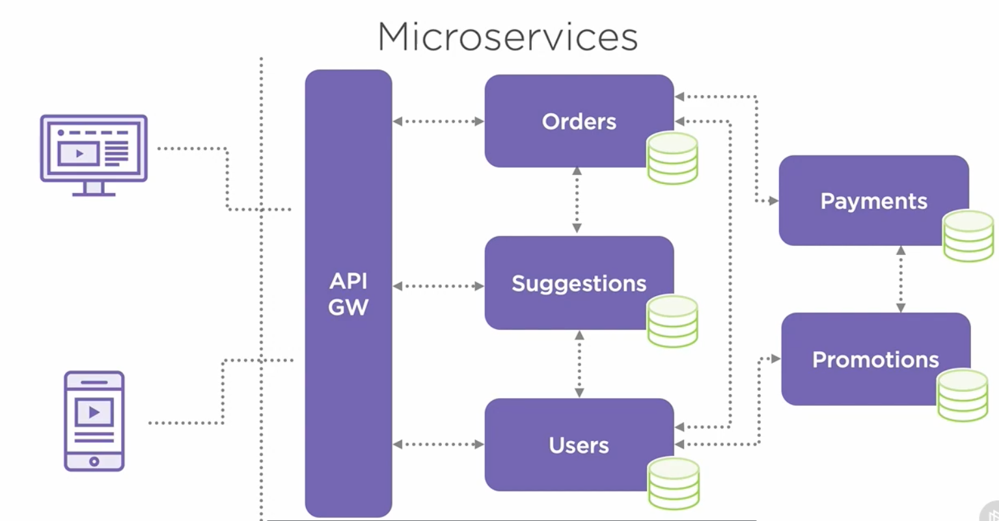
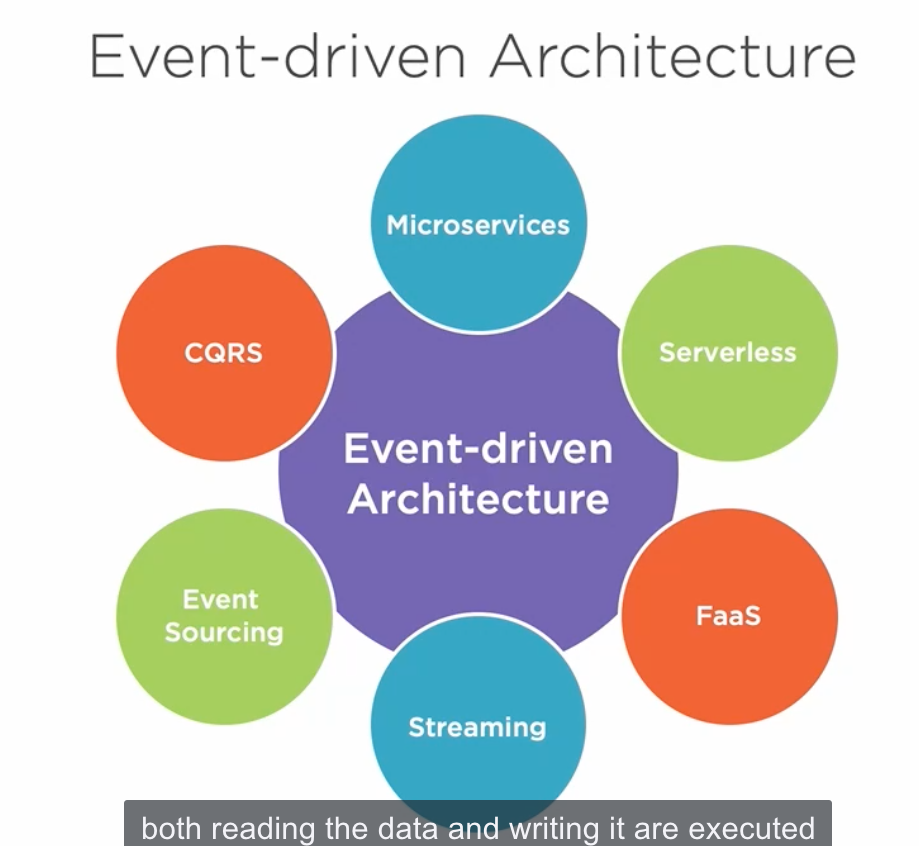
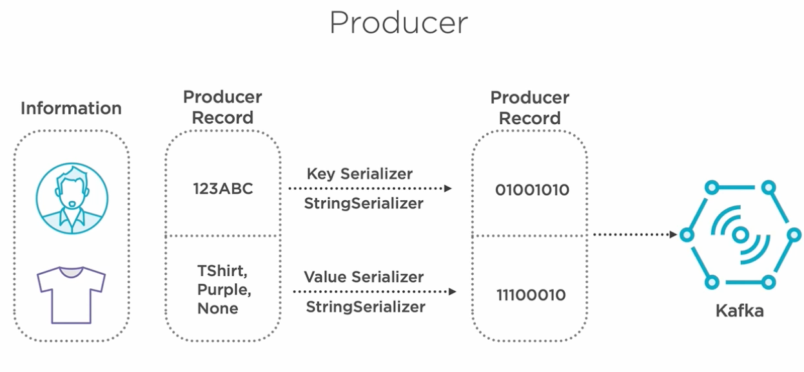

# Designing Event-Driven Applications Using Apache Kafka Ecosystem

Microservices: 

- In order to ensure loose coupling, having a database per service is essential. And each service can use the type of database most suitable.

- The services are inter-connected through some light-weight protocols, often being REST APIs or remote procedure calls.

- To have a single point of entry for the client, an API gateway (routing, authentication and monitoring) is required. 

- Dependencies between microservices become something called microservices hell. Make it very difficult to track and manage the data throughout the system. 

## Event-driven Architecture (EDA)

Everything resolves around events and not the data. 
- Microservices pattern decoupled with a broker-based technology.

## Building Your First Apache Kafka Application

By default, the broker is set to store the messages for seven days and then delete them. You can change this by setting the retention time. 

Upsert: Update and insert. (Compaction topic)

