# Getting Start with Apache Kafka

Publisher and subscriber config, decouple the UI service from the item service for future change of the item service, as long as follow the interface. UI only cares writing to one queue and then listen to another queue.

The system where the channels live and handle this requests as an Event Bus, or more recently, streaming platforms.

The channel where the messages follow is called channel or topic.

## Kafka

Kafka is a resilient, fast, and scalable event-driven platform.

Topics:

- Kafka Architecture
- Creating and Configuring Producers and Consumers
- Kafka Streams
- Kafka Connect
- Perform Administrative Tasks

Recommend to have the odd number of Kafka brokers.

Kafka can run with or without Zookeeper. And what's zookeeper responsible for:

- Service discovery
- Service address retrieval
- Management of election

Basically in the distributed Kafka clusters, zookeeper knows where everyone is, to which each one who should connect to and help in the process of electing leaders.

Kafka connect: Just run a simple command, everything in the topic goes into or out of your system (MongoDB, Elasticsearch, Files, S3... )

Kafka streams: You can create producers/consumers at the same time as a stream of messages.

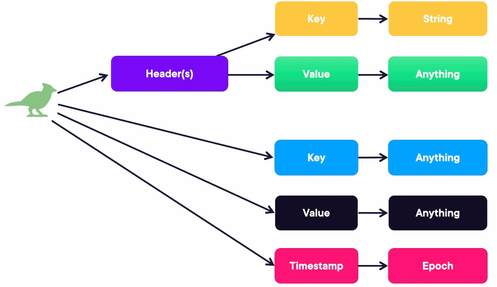

How is Kafka distributed:

- Confluent cloud; Cloudera; Strimzi

## Download the Kafka CLI to Interact with Brokers and Send Messages

In the libs directory is where you want to install plugins and make extension of Kafka. (Lots of jar)

Send message to Kafka

```zsh
        kafka-console-producer.sh --bootstrap-server 127.0.0.1:9092 --topic first_topic // Communication happens after.

        kafka-console-consumer.sh --bootstrap-server 127.0.0.1:9092 --topic first_topic --from-beginning // Get messages of the topic from beginning

        curl localhost:8082/topics // Get topics from kafka

        kafka-topics.sh --create --bootstrap-server 127.0.0.1:9092 --replication-factor 1 --partitions 3 --topic myorders

        // Kafka reassign partitions - when see too much load on a broker. Consumer never catches up.
        less increase_replication.json // file to increase the replication.

        kafka-reassign-partitions.sh --bootstrap-server 127.0.0.1:9092 --reassignment-json-file increase_replication.json --execute
```

Consumers can decide which message to read and from when.

The partitioner uses the key to distribute the messages to the correct partition. With the key, the message is decided to be sent to which partition (broker).

Not all topics need to be partitioned equally.

Consumer read (topic a, partition 0): from-beginning, from-end (kafka won't deliver message, but will record the consumer with id is at the end of the messages), internal offset.

Consumers read from partitions and have an offset, therefore, more partitions enable more consumers, therefore more scalability.

If one partition doesn't have any replica online, the topic is offline. Even though you can run consumer in this case, it won't receive any message, because the message is sent to the void. Since one of the partitions doesn't have a leader, which means the topic is offline.

If you bring up the broker 2, then it will self-heal.

## Kafka Producer

The kafka record has key and value and could also have headers.

Set up --group1, more consumers from the same group will share the load to consume the topic.

```zsh
        kafka-console-producer.sh --bootstrap-server 127.0.0.1:9092 --topic myorders --property "parse
.key=true" --property "key.separator=:"
```

In the demo, for two consumers in the same group, one consumer got "hello from ps" with key axel, the other consumer gets nothing. This is because, the same key always goes to the same partition with which one consumer is listening to. The other consumer within the same group is listening to the other consumer.

The key is so important, and now you can see how the values are distributed with keys. The two consumers didn't see all the messages, but partial message.

// Describe all consumers and their groups

```zsh
kafka-consumer-groups.sh --all-groups --all-topics --bootstrap-server 127.0.0.1:9092 --describe
```

### Code Kafka with Java

Serializer and Producer Configuration

- Need to config just one broker where it exists.
- In kafka jargon, broker is called bootstrap server.
- Type you send to kafka must match with the serializer type here. Otherwise, it breaks.

```java
Properties properties = new Properties();
properties.put(ProducerConfig.BOOTSTRAP_SERVERS_CONFIG, "localhost:9092");
properties.put(ProducerConfig.KEY_SERIALIZER_CLASS_CONFIG, StringSerializer.class);
properties.put(ProducerConfig.VALUE_SERIALIZER_CLASS_CONFIG, IntegerSerializer.class);

// Init the producer object.
KafkaProducer producer = new KafkaProducer<>(properties);

// Create a producer record
// Send the key as state and value as amount
// You can also easily send partition or headers
ProducerRecord producerRecord = new ProducerRecord<>("my_orders", state, amount);

// Finally, send the record, what we get back is a future, we can wait on this future.
Future send = producer.send(producerRecord);

if (metadata.hasOffset()) {
    System.out.format("offset: %d\n", metadata.offset()),
}

System.out.format("partition: %d\n", metadata.partition());
System.out.format("timestamp: %d\n", metadata.timestamp());
System.out.format("topic: %s\n", metadata.topic());
System.out.format("toString: %s\n", metadata.toString());

// Capturing a callback
producer.send(producerRecord, new Callback() {
    // With an onComplete override
    @Override
    public void onComplete(RecordMetadata metadata, Exception e) {
        ....
    }
})

// Last option is to use Lambdas

producer.send(producerRecord, (metadata, e) -> {
    if (metadata != null) {
        System.out.printLn(producerRecord.key());
        System.out.printLn(producerRecord.value());
    }
})

// At the end of the loop, be a good citizen, flush the buffer
producer.flush();
producer.close();
```

## Create Folder Directory for JAVA

```zsh
mkdir -p src/main/avro
mkdir -p src/main/java
mkdir -p src/test/java
mkdir -p src/main/resources
mkdir -p src/test/resources

# Create consumer
kafka-console-consumer.sh \
--bootstrap-server localhost:9092 \
--topic myorders --from-beginning \
# Set the key is going to be a string, split the key and the value
--key-deserializer org.apache.kafka.common.serialization.StringDeserializer \
--value-deserializer org.apache.kafka.common.serialization.DoubleDeserializer \
--property print.key=true \
--property key.separator=, \
--group 1

# First thing needs to do in the maven project is
mvn clean compile
# To run the built
mvn exec:java
```

The response from the producer.send() method is a Future, but you can capture it in a Callback or Lambda

There are Retryable and non-retryable Exceptions and based on that the Protocol will automatically retry.

## Consumers

Consumers are typically done as a group (groupID) - Adding another consumer to the group.

When a consumer joins the group, it sends the single to an object called the coordinator of such group. Partitions are re-assigned to the consumers in the consumer group, trying to balance them out evenly.

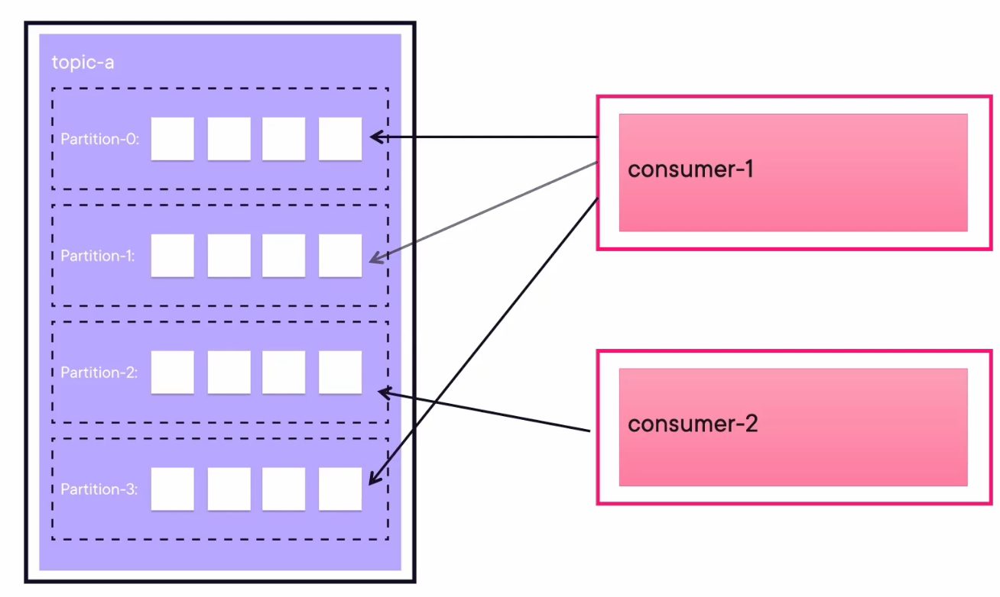
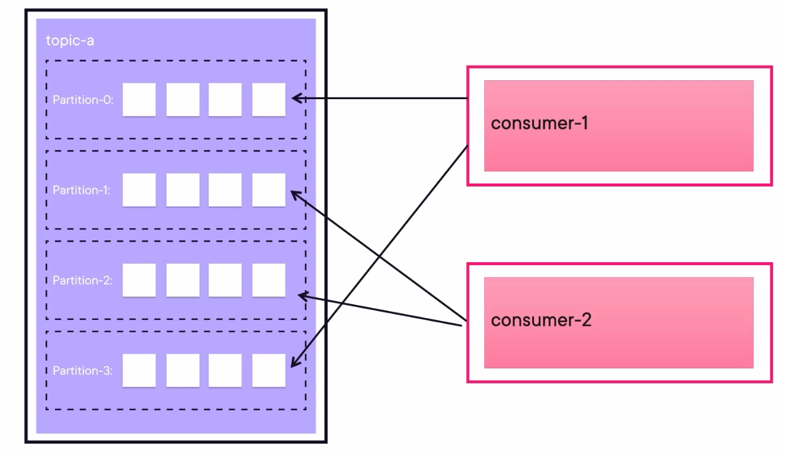
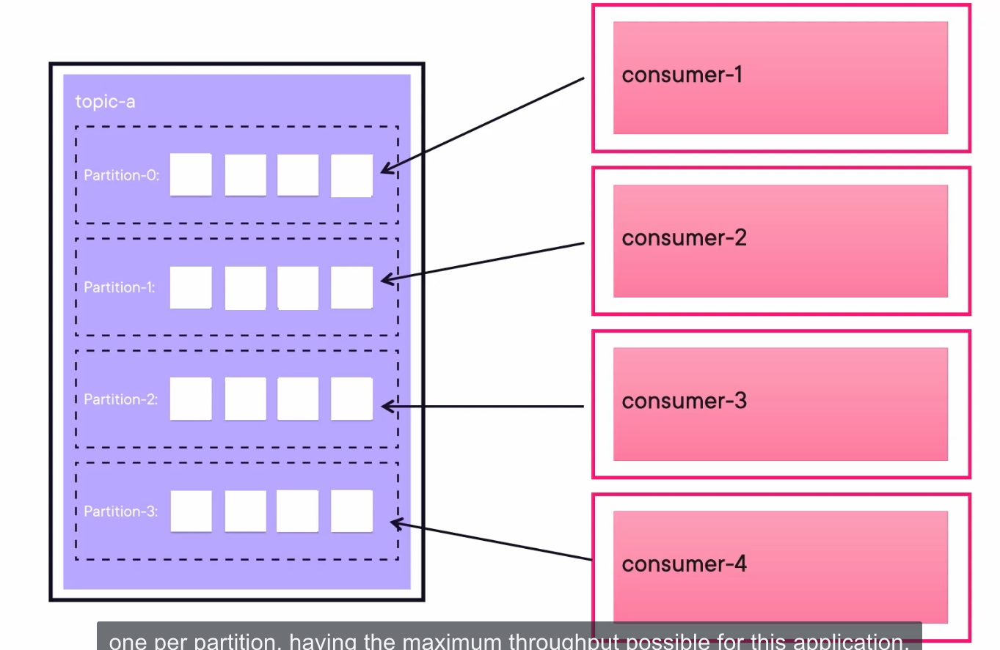

- If more consumer joined, it becomes idle. Partition can't be shared by consumers. Many-to-one.

- In a consumer group. Partitions don't share across consumers. One partition only belongs to one consumer. But many consumers can share just one partition.

Consumer with Java

```java
Properties properties = new Properties();
properties.put(ConsumerConfig.BOOTSTRAP_SERVERS_CONFIG, "localhost:9092")
properties.put(ConsumerConfig.GROUP_ID_CONFIG, "my_group");
properties.put(ConsumerConfig.KEY_DESERIALIZER_CLASS_CONFIG, "org.apache.kafka.common.serialization.StringDeserializer");
properties.put(ConsumerConfig.VALUE_DESERIALIZER_CLASS_CONFIG, "org.apache.kafka.common.serialization.IntegerDeserializer");
properties.put(ConsumerConfig.AUTO_OFFSET_REST_CONFIG, "earliest"); // if I haven't seen you before, what should I do.
KafkaConsumer<String, String> consumer = new KafkaConsumer<>(properties);

while (!done.get()) {
    // ConsumerRecords is a custom collection class provided by Kafka for handling records in an efficient and structured way. ConsumerRecords<K, V> hols multiple ConsumerRecord<K, V> objects. 

    // Iteration: You can iterate over all the records using a for-each loop, as ConsumerRecords implements Iterable<ConsumerRecord<K, V>>. It also allows you to iterate over the records partition by partition. 

    // Think of it as a collection of records, which can be grouped and accessed by partition. 

    // In essence, ConsumerRecords<String, String> provides an efficient way to handle multiple Kafka messages in a single poll operation, where each message has a key and value of type String. 
    ConsumerRecords<String, String> records = consumer.poll(Duration.of(500, ChronoUnit.MILLIS)); 
    for (ConsumerRecord<String, String> record : records) {
        System.out.format("offset: %d\n", record.offset());
        System.out.format("partition: %d\n", record.partition()); 
        System.out.format("timestamp: %d\n", record.timestamp());
        System.out.format("timeStampType: %s\n", record.timestampType());
        System.out.format("topic: %s\n", record.topic());
        System.out.format("key: %s\n", record.key());
        System.out.format("value: %s\n", record.value());
    }

    consumer.close(); // Kafka knows this partition is not related to this consumer anymore, thus can do rebalance. 
}
```

```java
Thread haltedHook = new Thread(consumer::close);
// This method registers a shutdown hook, which is a thread that runs when the JVM is shutting down (either normally or due to an external single like Ctrl+C or a termination signal). 

// Ensure that the consumer properly closes its connections and commits any offsets. By adding the shutdown hook, the consumer.close() method will automatically be called when the JVM is shutting down, ensuring a graceful shutdown. 

Runtime.getRuntime().addShutdownHook(haltedHook);

consumer.subscribe(Collections.singletonList("myorders"));
```
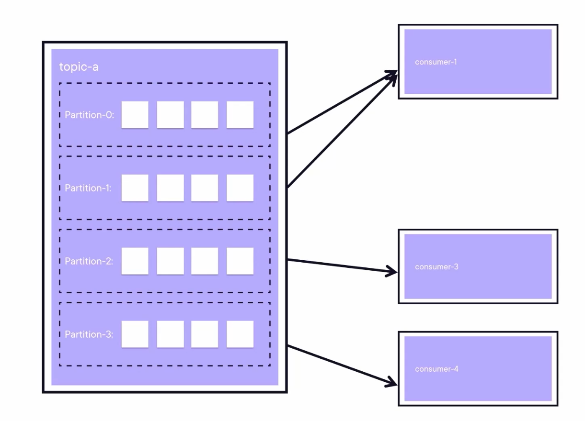


```java
// Process record

private static void processRecord(ConsumerRecord record) {
    log.info("Received message with key: " + record.key() + " and value " + record.value());
    log.info("It comes from partition: " + record.partition()); 
    try {
        Thread.sleep(1000);
    } catch (InterruptedException e) {
        System.out.println(e.getMessage());
    }
}
```


```zsh
# Run the Java file
mvn clean install exec:java -Dexec.mainClass="com.globomantics.Consumer" -Dexec.args="1"
```

```zsh
# Describe all consumers
kafka-consumer-groups.sh --all-groups --all-topics --bootstrap-sever localhost:9092 --describe
```

One partition can be assigned to two different consumers in different groups. However, one partition can't be assigned to two consumers in the same group. 

Consumers act as a group via the Consumer group ID. Each consumer in the group gets assigned a partition, and a partition is not shared by two members of a group . A rebalance is triggered when a member leaves the group or they haven't sent a heartbeat in a log time. A rebalance is a stop the world event that ensures all partitions are attended by some consumer in the group. 


Be sure to configure your Consumer to ensure you are not duplicating messages.

## Kafka Streams

### Kafka Connect 
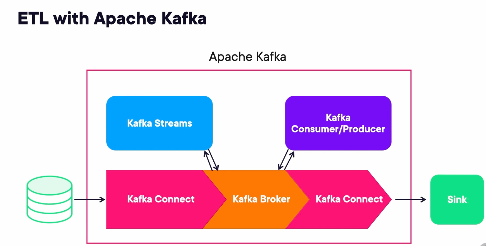

Kafka connect helps tons to avoid writing code to integrate these systems.

One important statement is that Kafka Connect is not an ELT per se, it only connects. 

In Standalone mode, configuration and offsets are inside worker.

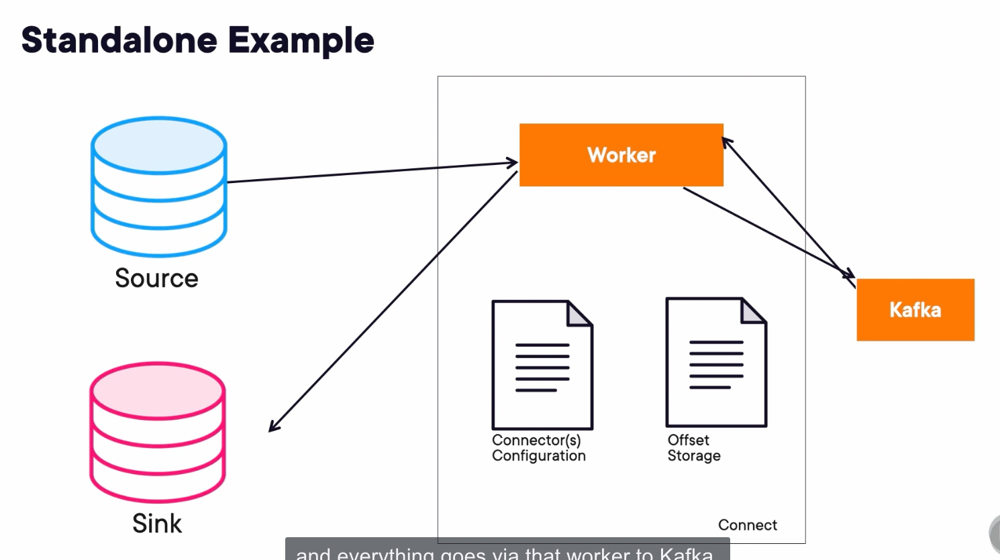

Configuration and offsets information will be inside topics inside Kafka in distributed mode.

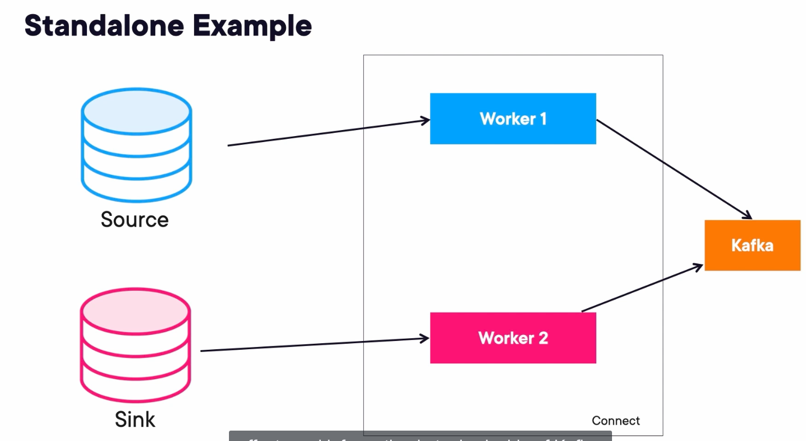


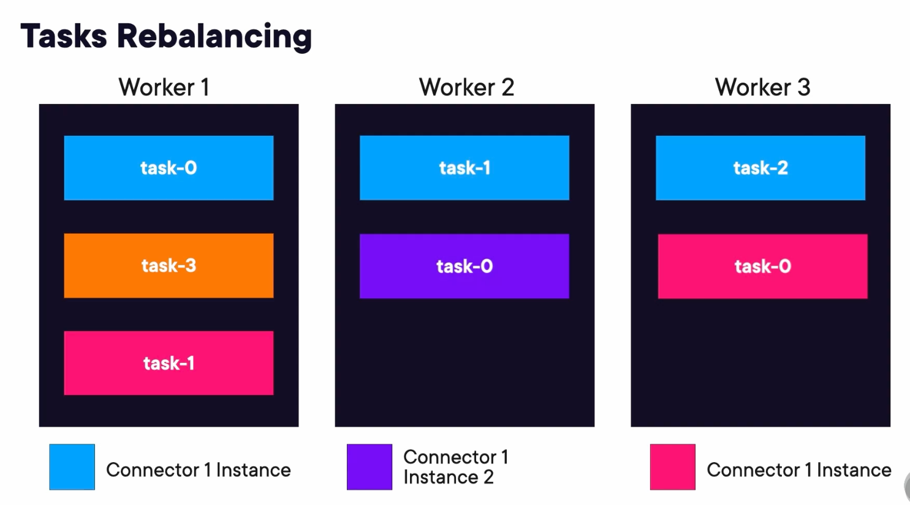
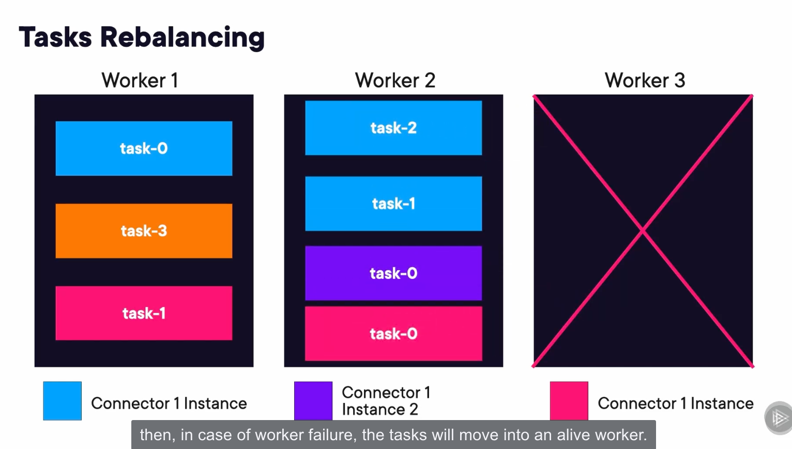


```zsh
# command
# module6 demo1
connect-standalone.sh worker.properties filesink.properties
```

plugin.path=/Users/someone/kafka_2.13-3.5.1/libs // Absolute path to the libs directory, which contains all the connectors. 


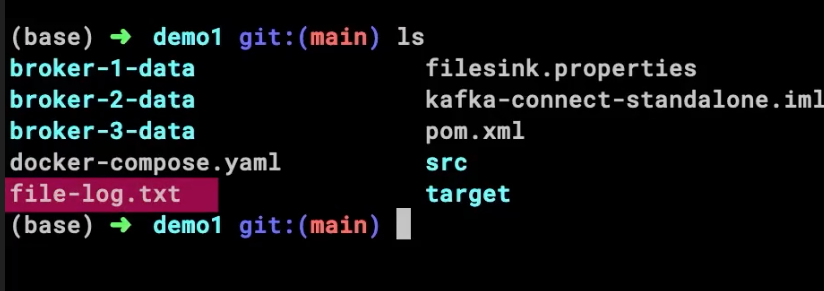

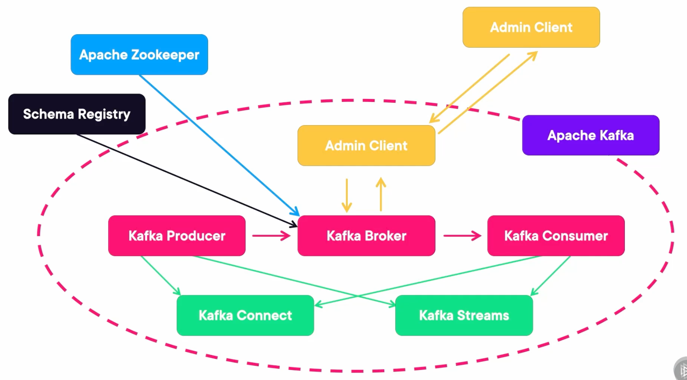

Avro defines the Schema as JSON and YAML. Has plenty code generation available. 

Kafka knows how to read Avro. Serialize and de-serialize those classes. 

```java
Properties properties = new Properties(); 

properties.put(ProducerConfig.BOOT_STRAP_SERVERS_CONFIG, "localhost:9092"); 
properties.put(ProducerConfig.KEY_SERIALIZER_CLASS_CONFIG, StringSerializer.class); 
properties.put(ProducerConfig.VALUE_SERIALIZER_CLASS_CONFIG, io.confluent.kafka.serializers.KafkaAvroSerializer.class);
properties.setProperty("schema.registry.url", "http://localhost:8081");

Album album = new Album("Purple Rain", "Prince", 1984, Arrays.asList( "Purple Rain", "Let's go crazy" )); 
ProducerRecord<String, Album> producerRecord = new ProducerRecords<>("music_albums", "Prince", album); 
producer.send(producerRecord);
```

```java
Properties properties = new Properties(); 
properties.put(ConsumerConfig.BOOTSTRAP_SERVERS_CONFIG, "localhost:9092");
properties.put(ConsumerConfig.GROUP_ID_CONFIG, "my_group"); 
properties.put(ConsumerConfig.KEY_DESERIALIZER_CLASS_CONFIG, "org.apache.kafka.common.serialization.StringDeserializer"); 
properties.put(ConsumerConfig.VALUE_DESERIALIZER_CLASS_CONFIG, io.confluent.kafka.serializers.KafkaAvroDeserializer.class);
properties.setProperty("schema.registry.url", "http://localhost:8081");
properties.setProperty("specific.avro.reader", "true");
```

Schema Registry Consumer: What makes schema registry work is the Deserializer. You must add schema.registry.url and specify the location of the registry. You must add specific.avro.reader and specify that you use specific avro mode. 

```java
while (true) {
    ConsumerRecords<String, Album> records = consumer.poll(Duration.of(500, ChronoUnit.MILLIS)); 
    for (ConsumerRecord<String, Album> record : records) {
        System.out.format("offset: %d\n", record.offset()); 
        System.out.format("partition: %d\n", record.partition()); 
        System.out.format("timestamp: %d\n", record.timestamp()); 
        System.out.format("timeStampType: %s\n", record.timestampType()); 
        System.out.format("topic: %s\n", record.topic(0)); 
        System.out.format("key: %s\n", record.key());
        Album a = record.value(); 

        System.out.format("value: %s\n", a.getTitle());
        System.out.format("value: %s\n", a.getArtist());
    }
}
```

### Using the debezium connector with Distributed Kafka Connect to query a topic

Use MongoDB sink connector to write into a MongoDB instance. 

Use Avro converter to be able to use Avro and schema registry with Kafka Connect in a Kafka distribute mode to write into database. 

Use confluent client-hub to install connectors
<code> brew tap confluentinc/homebrew-confluent-hub-client </code>
<code> brew install --cask confluent-hub-client </code>

Objective: 
- Download the MongoDB sink connector
- Download the Kafka Connect Avro converter

<code> confluent-hub install confluentinc/kafka-connect-avro-converter:7.5.0 --component-dir /usr/local/Cellar/kafka/3.8.0/libexec/libs --worker-configs worker.properties </code>


Install the MongoDB sink connect
<code> confluent-hub install mongodb/kafka-connect-mongodb:1.11.0 --component-dir /usr/local/Cellar/kafka/3.8.0/libexec/libs --worker-configs worker.properties </code>

Avro file:  The property way to write to the database. 
- With schema registry and set the schema for the message that are going into the database with Avro. 

The big change in the properties of AlbumSender.java
<code> props.put(ProducerConfig.KEY_SERIALIZER_CLASS_CONFIG, KafkaAvroSerializer.class.getName()); </code>

Specify the schema registry url 
<code>props.put(KafkaAvroSerializerConfig.SCHEMA_REGISTRY_URL-CONFIG, "http://localhost:8081");

- Set distributed topics: --topic kafka_connect_statuses, kafka_connect_offsets, kafka_connect_configs

Now we are ready to run Kafka Connect in distributed mode
<code> connect-distributed.sh worker.properties </code>

### Deploy Connectors (An ACTUAL HTTP REQUEST)  

http://localhost:8083/connectors

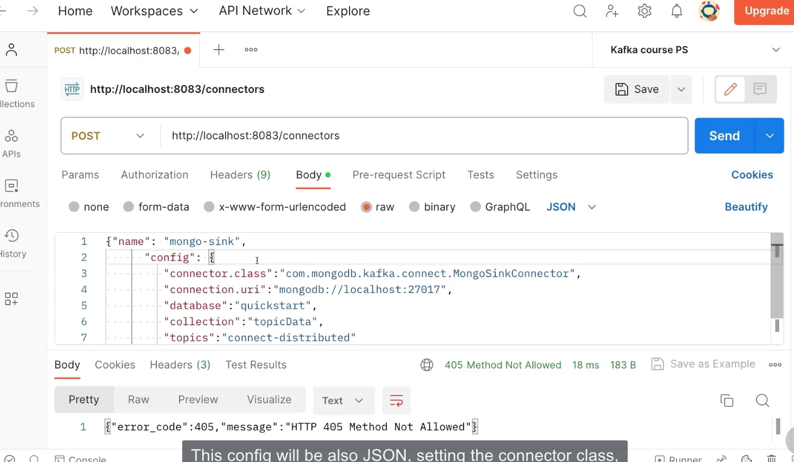

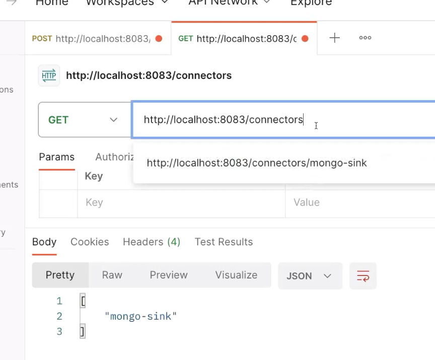

Send object and check if the object has been written into mongoDB

<code>mongosh localhost:27017</code>
```zsh
show dbs
use quickstart
db.topicData.find()
```

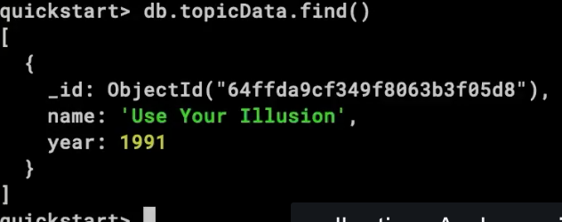

Kafka connect to connect to schema registry and ecosystem of connectors. 

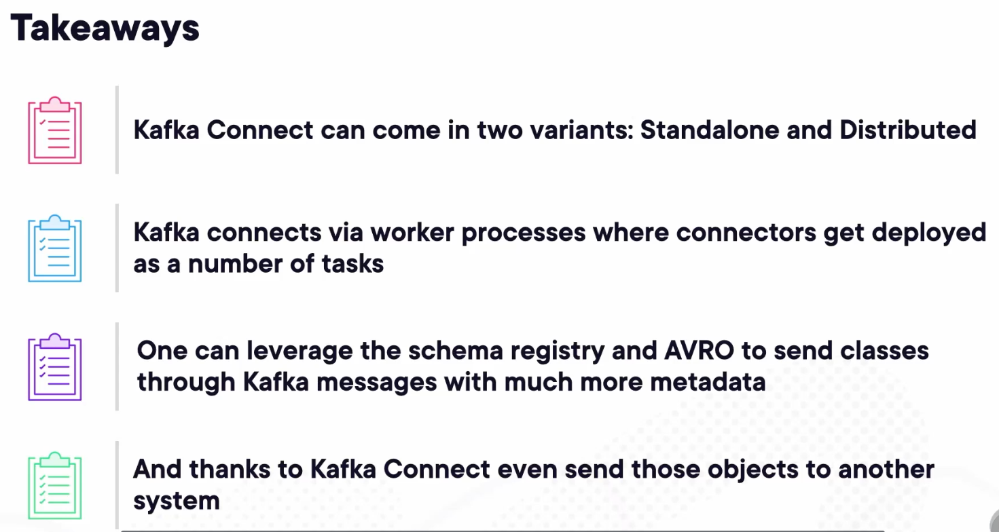 

Most of the services we are talking about will be Kafka Streams apps. And each of the messages between topics will be immutably unreplayable.

Synchronous microservices via REST, gRPC. Asynchronous microservices via messaging (Kafka, Message But, etc...)

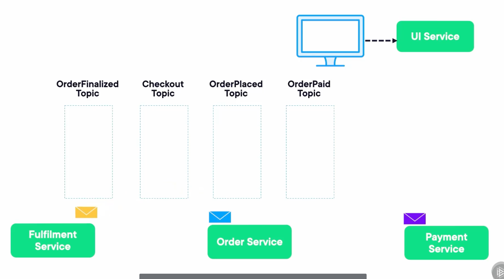

There is not a lot of dependencies. All of the dependencies are based on the interface. All of the services are decoupled, declaring dependencies in an implicit way. 

Log makes it possible to replay messages, which means Kafka becomes the WAL of the application and allows for things like multi-phase transactions. 

## Can we Query Kafka so we have the information without creating consumers 

Kafka streams and stateless streaming processing 

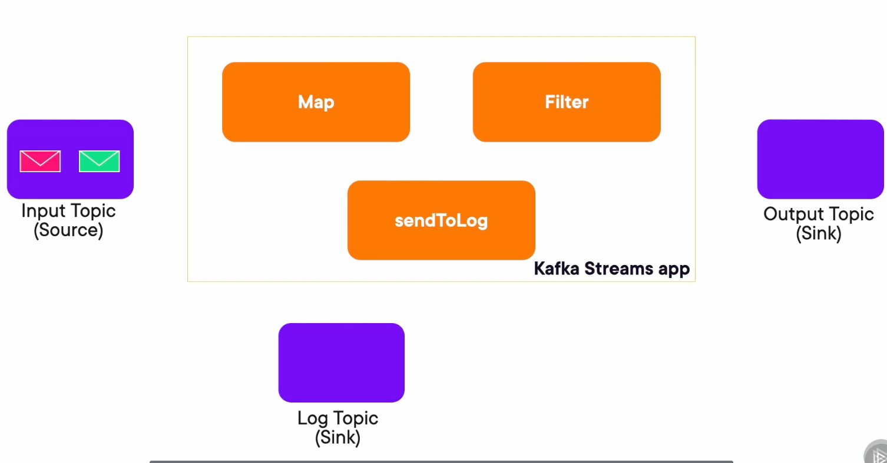

Kafka streams application is both consumer and producer at the same time. Read message gets filtered without going into output topic. 


There is no direct query lang to query order topic. However, set Kafka streams application can stream order topic and then write data into ToDB topic based on the correct schema defined using Avro. Then Kafka Connect can be used to transfer this data into the Database. Then expose query API, which exposes certain API into queries. 

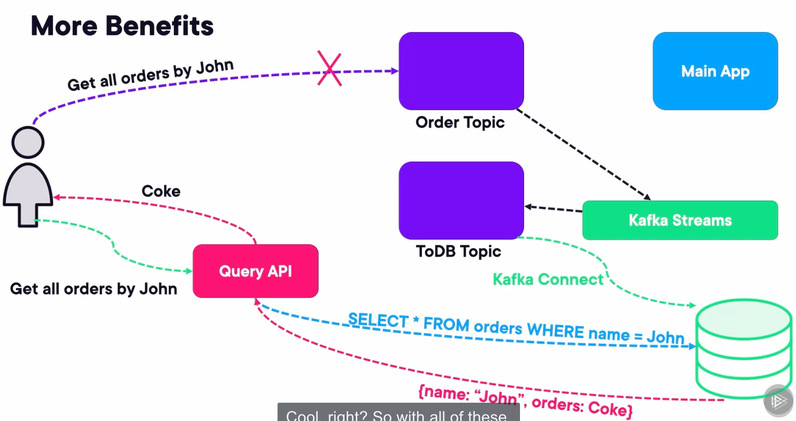

### Creating a Kafka Stream App

```java
Properties props = new Properties(); 
props.put(StreamsConfig.APPLICATION_ID_CONFIG, "my_stream_app");
props.put(StreamsConfig.BOOTSTRAP_SERVERS_CONFIG, "localhost:9092");
props.put(StreamsConfig.DEFAULT_KEY_SERDE_CLASS_CONFIG, Serdes.String().getClass());
props.put(StreamsConfig.DEFAULT_VALUE_SERDE_CLASS_CONFIG, Serdes.Integer().getClass());
props.put("schema.registry.url", "http://localhost:8081"); // locate the schema registry in case we need to send an object via Avro.

// Instantiate it as a StreamsBuilder. 
StreamsBuilder builder = new StreamBuilder();

KStream<String, DisasterValue> rawReadings = builder.stream("DisasterReadings", Consumed.with(Serdes.String(), Serdes.Integer())

// Mapping
(1, "Hello"), (2, "Zoom"), (3, "Fold")
stream.map((key, value) -> new KeyValue<>(key + 1, value + "!"));
(2, "Hello!"), (3, "Zoom!"), (4, "Fold!")
stream.filter((key, value) -> key % 2 == 0);

KStream stream = builder.stream("my_topic");
stream.filter(...).through("new_topic").flatMap(...).to("other_topic");

// Dump Results to a Topic 
// Dump the results to a topic using through to post to topic and continue

// And Run
Topology topology = builder.build();
KafkaStreams streams = new KafkaStreams(topology, props);
stream.start();

// Be a good citizen 
// This is an example of Java method reference fits the Runnable functional interface. 
Runtime.getRuntime().addShutdownHook(new Thread(streams::close));
// Adding a Shutdown Hook. As always, properly shutdown resources. 
```

Remember, APPLICATION_ID_CONFIG, where it's "weather.filter" set here. This is the groupID.

## Query a Stream with KSQL

Play with the ksql db. (ksqldb-server and ksqldb-cli)

```zsh
docker exec -it ksqldb-cli ksql http://ksqldb-server:8088
# goes into ksql
show all topics;

# add values
SET 'auto.offset.reset'='earliest'; # All of the changes from the beginning
# create a stream - similar as create a table in sql 
CREATE STREAM tempReadings (zipcode VARCHAR, sensortime BIGINT, temp DOUBLE)
WITH (kafka_topic='readings', timestamp='sensortime', value_format='json', partitions=1);

show topics extended;
show streams extended;
```
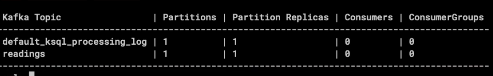
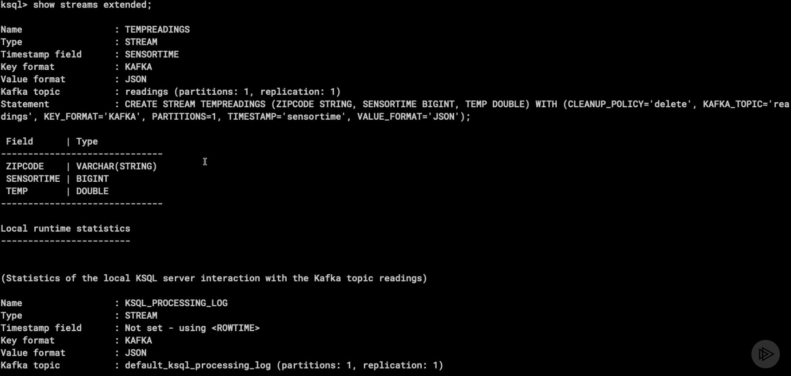

```zsh
# Nice query 
SELECT zipcode, TIMESTAMPTOSTRING(WINDOWSTART, 'HH:mm:ss') as windowtime,
COUNT(*) AS rowcount, AVG(temp) as temp
FROM tempReadings
WINDOW TUMBLING (SIZE 1 HOURS) # grouping group by timestamp of 1 hr.
GROUP BY zipcode EMIT CHANGES; # also group by zipcode (we group by two things).
# Stream continues monitoring

# Create a table
CREATE TABLE highsandlows WITH (kafka_topic='readings') AS 
SELECT MIN(temp) as min_temp, MAX(temp) as max_temp, zipcode
FROM tempReadings GROUP BY zipcode;

SELECT min_temp, max_temp, zipcode
FROM highsandlows
WHERE zipcode='1865'; 

# Table gets the latest value, then exit.
```

Try to create a table instead of a stream and query it. 

Try to investigate how to use groupBy and perform JOINs.

Try to deploy the architecture we mentioned above to query a topic.

## Kafka Administration

What does the server have for certification. 

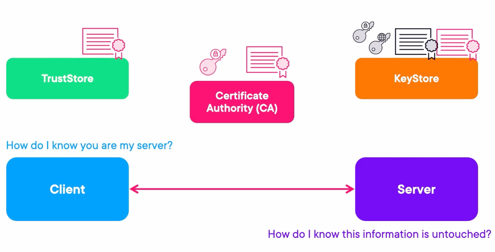


Server: 
- The key of the certificate such that the CA can sign that certificate. So the client can see and trust it because it's like a stamp of approval.

- Since it's server, it also needs its own certificate with private and public key. 

- If you are a client, you just need a trust store with signed CA. 
- If you are a server, besides having a trust store with signed CA, you also need your own certificate with private and public keys, this requires a keystore too. 

```zsh
curl localhost:8082/brokers
# create the topics
# use java - create folder struct

# Build the CA authority to sign the CA certificate. Then need keystore and trust store for both the Zookeepers and the brokers. 

# Check the security folder. 
## Generate CA
openssl req -new -x509 -keyout $CA_KEY_FILE -out $CA_CERT_FILE -days $VALIDITY_DAYS

## Generate keystore
COMMON_NAME=$1
ORGANIZATIONAL_UNIT="Community"
ORGANIZATION="Pluralsight"
CITY="Utah"
STATE="UT"
COUNTRY="US"

CA_ALIAS="ca-root"
CA_CERT_FILE="ca-cert"
VALIDITY_DAYS=36500

# Generate Keystore with Private Key
keytool -keystore keystore/$COMMON_NAME.keystore.jks -alias $COMMON_NAME -validity $VALIDITY_DAYS
# Generate Certificate Singing Request (CSR) using the newly created KeyStore
keytool -keystore keystore/$COMMON_NAME.keystore.jks -alias $COMMON_NAME -certreq -file $CA_CERT_FILE 
# Sign the CSR using the custom CA
openssl x509 -req -CA ca-cert -CAkey ca-key -in $COMMON_NAME.csr -out $COMMON_NAME.sign
# and more

## Generate TrustStore
INSTANCE=$1
CA_ALIAS="ca-root"
CA_CERT_FILE="ca-cert"

#### Generate TrustStore and import ROOT CA certificate
keytool -keystore truststore/$INSTANCE.truststore.jks -import -alias $CA_ALIAS -file $CA_CERT_FILE 
```
### Encryption Zookeeper

Online fashion and Offline fashion. 

### Encryption Producers and Consumers

```yaml
KAFKA_LISTENERS: HOST_PLAINTEXT://broker-1:9091
KAFKA_ADVERTISED_LISTENERS: HOST_PLAINTEXT://broker-1:9091 // This is for client not for brokers themselves
KAFKA_LISTENER_SECURITY_PROTOCOL_MAP: HOST_PLAINTEXT:PLAINTEXT
```

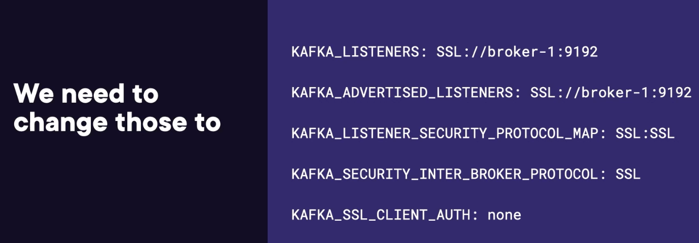

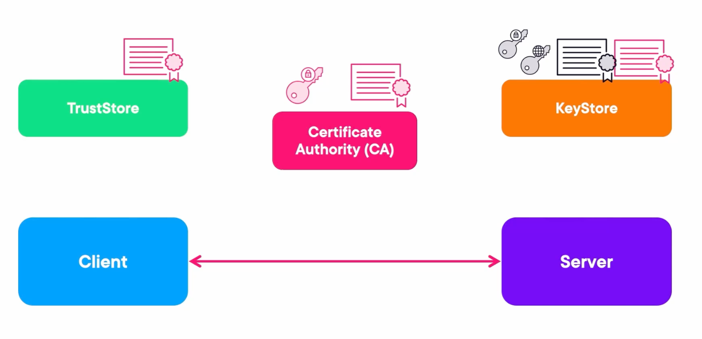

Understand what do keystore and truststore hold
- Truststore only holds the signed CA certificate. 
- Keystore holds not only the signed CA certificate, but also server's own certificate, public and private keys.  