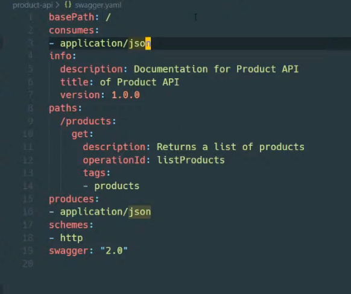
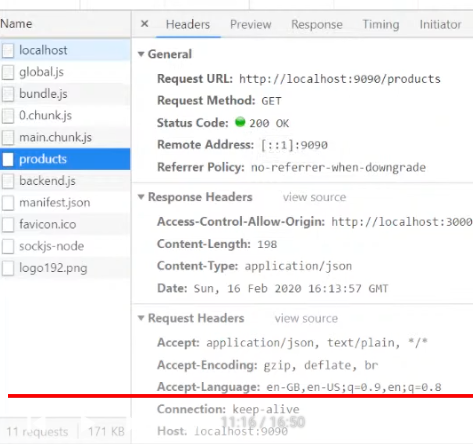
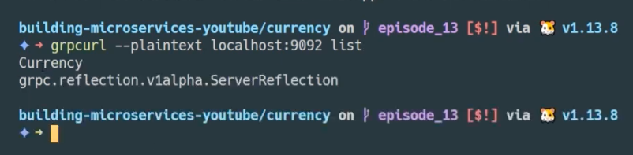
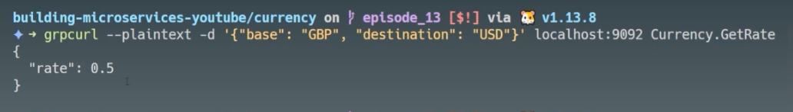
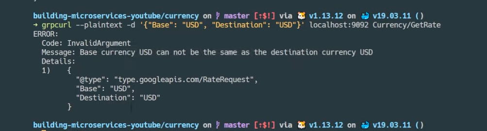

# Building Go Microservices YouTube

[Link](https://www.youtube.com/watch?v=VzBGi_n65iU&list=PLmD8u-IFdreyh6EUfevBcbiuCKzFk0EW_)

## Some understanding of using remote repo

- In your root directory which is a git project. You can use submodules for remote repos. Submodule has its own .git and links to its own remote repo. However, the change difference of submodule can be tracked in your git project.

- In order to have and work with all branches of submodule. You need to explicitly fetch all remote branches and then download all of them. <code> git fetch all </code>

```zsh
for branch in $(git branch -r | grep -v '\->' | sed 's/origin\///'); do
    git checkout --track origin/$branch;
done
```

- In order to keep a copy of your submodule with all its branches. You need to create a git repo in the github and then use the following command to push all the branches to the remote repo.

```zsh
git push --all -u origin # vs. git push -u origin main // this only push one main branch
```

## Write json marshal to response writer

- Use http.Error(w, "Unable to marshal json", http.StatusInternalError). This convenient method writes error back to the response writer.

- Use w.Write(b) to write bytes directly into response writer.

- Use <code> curl localhost:9090 </code> to retrieve the json data. You can pipe that into the command jq. <code> curl localhost:9090 | jq </code> to get formatted string.

```go
// struct tags

type Product struct {
    ID int `json:"id"`
    Name string `json:"name"`
    CreatedOn string `json:"-"` // completed ignore
    DeletedOn string
}
```

## About JSON encoder

Write an output directly to io.Writer (w responseWriter)

Fast and don't need to allocate space for the data. Take advantage of the performance benefit.

```go
// Define a type to clean the code
type Products []*Product

func (p *Products) ToJSON(w io.Writer) error {
    e := json.NewEncoder(w)
    return e.Encode(p) // encode myself
}

err := lp.ToJSON(w)  // called in the handler, much cleaner
```

Benefit of using the framework

```go
// check the method
if r.Method == http.MethodGet {
    p.getProducts(rw, r)
    return
}

// catch call
rw.WriteHeader(http.StatusMethodNotAllowed)

// if curl localhost:9090 -XDELETE -v | jq // If change http method, the method is not allowed.
```

# 4. More RESTful services

Create our own handler struct that we can use dependency injection.

```go
if r.Method == http.MethodPost {
    p.addProduct(rw, r)
    return
}

// do some logging
p.l.Println("Handle POST product")

/*
When add -d option to add some data in curl, it becomes the POST request.
curl localhost:9090 -d `{}` | jq

If use -v verbose mode, you will see more details regarding request sent to http server.
*/

// Use Decoder which is opposite to Encoder

func (p *Product) FromJSON(r io.Reader) error {
    d := json.NewDecoder(r)
    return d.Decode(p)
}

// use Response body of http
err := prod.FromJSON(r.Body)

p.l.Printf("Prod: %#v", prod) // can see the fields of the struct

// use PUT to update
if r.Method == http.MethodPut {
    // expect the id in the URI
    reg := regexp.MustCompile(`/([0-9]+)`)
    g := reg.FindAllStringSubmatch(r.URL.Path, -1)

    // len(g[0]) == 2, which is [[/1 1]]. It always match the entire string before the group.

    if len(g) != 1 {
        http.Error(rw, "Invalid URI", http.StatusBadRequest)
        return
    }

    if len(g[0]) != 1 {
        // defensive code
    }
    idString := g[0][1]
    id, err := strconv.Atoi(id)
    if err != nil {
        // defensive code
    }

    p.updateProducts(id, rw, r)
    return

    func (p Products) updateProducts(id int, rw http.ResponseWriter, r *http.Request) {
        // same as post
    }
}

/*
Test PUT command

curl localhost:9090/1 -XPUT -d {"name": "tea", "description": "a nice cup of tea" } | jq
*/
```

Note one thing, the properties and methods of an object are separated. When use FromJSON, you will fill the properties of the object. You don't need to worry about the methods. The methods are defined there to work with the properties. You can just call the methods on the properties.

Note, for handler, it's just an interface. You can define an interface which implements ServeHTTP(w, r) and that's it. And the methods of the struct can be called by handleFunc method.

## Gorilla framework - with much cleaner code

```go
// main.go
sm := mux.NewRouter() // github.com/gorilla/mux. This is more like a root router
getRouter := sm.Methods("GET").Subrouter() // Subrouter method converts it to a router
getRouter.HandleFunc("/", ph.GetProducts)

putRouter := sm.Methods(http.MethodPut).Subrouter()
putRouter.HandleFunc("/{id:[0-9]+}", ph.UpdateProducts) // UpdateProducts function don't need to take in id anymore. It uses vars := mux.Vars(r)
// Use middleware
putRouter.Use(ph.MiddlewareProductValidation)

vars := mux.Vars(r)
id, err := strconv.Atoi(vars["id"])

postRouter := sm.Methods(http.MethodPost).Subrouter()
postRouter.HandleFunc("/", ph.AddProduct) // Need to change addProduct to a public func
putRouter.Use(ph.MiddlewareProductValidation)


// Use middleware for validation - "Use"
// handlers/products.go

// Preferred way to use Context is to use a defined type key instead of just string
// Note the middleware is executed before the handler code.
type KeyProduct struct{}

func (p Products) MiddlewareProductValidation(next http.Handler) http.Handler {
    return http.HandleFunc(func(rw http.ResponseWriter, r *http.Request) {
        prod := data.Product{}
        // handle error with .FromJSON. if error return and stop the chain

        ctx := r.Context().WithValue(KeyProduct{}, prod) // Creates a new context from request context
        req := r.WithContext(ctx)

        next.ServeHTTP(rw, req)
    })
}

// Now we use middleware to pass the product value. We don't need to get product using the id.
// Get product from the context value.

prod := r.Context().Value(KeyProduct{}).(data.Product) // returns an interface, but safe for type assertion.

// Comparison, before using middleware, prod is from JSON
err := prod.FromJSON(r.Body) // then handle error.

// Now.
prod := r.Context().Value(KeyProduct{}).(data.Product)
data.AddProduct(prod)
```

## JSON Validation

go-playground/validator

```go
err := validate.Struct(mystruct)
validatorErrors := err.(validator.ValidationErrors)

type Product struct {
    ID int
    Name string `json:"name" validate:"required"`
    Price float32 `json:"price" validate:"gt=0"`
    SKU string `json:"sku" validate:"required,sku"` // add custom validation function
}

// github.com/go-playground/validator
func (p *Product) Validate() error {
    validate := validator.New()
    // Create custom validation function
    validate.RegisterValidation("sku", validateSKU) // Link and register the custom function with validation func
    return validate.Struct(p)
}

func validateSKU(fl validator.FieldLevel) bool {
    // sku is of format abc-absd-bscd
    re := regexp.MustCompile(`[a-z]+-[a-z]+-[a-z]+`)
    matches := re.FindAllString(fl.Field().String(), -1)

    if len(matches) != 1 {
        return false
    }

    return true
}

// Now inside the middleware - handlers > products.go -> MiddlewareValidateProduct
// Inside the middleware returned http.Handler function

err := prod.FromJSON(r.Body)
if err != nil {...}
err = prod.Validate() // Do the validation of the Unmarshal prod object.
if err != nil {...} // Return without go through the next handler.
```

So validation makes it a very nice way to validate the data in the bounds and also present the client with a nice error message explaining which field fails the validation.

## Swagger - How to document the API using the OpenAPI standard

Swagger goswagger.io

Write top-level documentation for our API. -> swagger:meta (example of the top-level documentation)

```go
// Package classification of Product API
//
// Documentation for Product API
//
// Schemes: http
// BasePath: /
// Version: 1.0.0
//
// Consumers:
// - application/json
//
// Produces:
// - application/json
// swagger:meta
```

Use the goswagger tool to generate the doc.
Makefile (put it in the makefile)

```Makefile
check_install:
    which swagger || GO111MODULE=off go get -u github.com/go-swagger/go-swagger/cmd/swagger
swagger: check_install
    GO111MODULE=off swagger generate spec -o ./swagger.yaml --scan-models
```

```go
// swagger:route GET /products products listProducts
// Returns a list of products.
// responses:
//     200: productsResponse
```

```go
// Inside product-api>handlers>product.go>productResponse
// Only use it for documentation

// Need to use the swagger meta tag to show the object in the generated yaml document.

// A list of products returns in the response
// swagger:response productsResponse
type productsResponseWrapper struct {
    // All products     in the system
    // in: body
  Body []data.Products
}
```

```zsh
make swagger
```



Note since you have defined the type productsResponseWrapper which contains []data.Products, all the field info of Products have been pulled into the generated swagger yaml file. All because you are using

```go
// swagger:response productsResponse
```

### Serve the documentation

```go
/*
Use ReDoc, which has a handler to serve swagger specification directly from the go code.
This uses middleware Redoc package. github.com/go-openapi/runtime/middleware
*/
opts := middleware.RedocOpts{SpecURL: "/swagger.yaml"} // Change from default json to yaml.
sh := middleware.Redoc(opts, nil)

// Add a doc handler using middleware package from Redoc
getRouter.Handle("/docs", sh)

// serve the file in the server
// then go to: localhost:9090/docs
getRouter.Handle("/swagger.yaml", http.FileServer(http.Dir("./"))) // Add basic file serving capability

/*
Now we have the swagger. -> localhost:9090/swagger.yaml
Now if you go to the doc path. -> localhost:9090/docs
*/

// Add swagger meta data to the DELETE route

// swagger:route DELETE /products/{id} products deleteProduct // id refers to deleteProduct function
// Returns
```

If you are looking for serving large file, you need to look into gzip as well.

```go
// swagger:parameters deleteProduct // This is not the name, this is the function it relates.
type productIDParameterWrapper struct {
    // The id of the product to delete from the database
    // in: path
    // required: true
    ID int `json:"id"`
}
```

```go
// swagger:model
type Product struct {
    // the id for this user
    //
    // required: true
    // min: 1
    ID int `json:"id"`
}
```

Based on the swagger doc you can use codegen to generate client lib

## Auto-generating HTTP clients from Swagger files

```go
// swagger:route POST /products products createProduct
// Create a new product
//
// responses:
// 200: productResponse
// 422: errorValidation
// 501: errorResponse

// Create handles POST requests to add new products
func (p *Products) Create(rw http.ResponseWriter, r *http.Request) {
    // fetch the product from the context
    prod := r.Context().Value(KeyProduct{}).(data.Product)
    p.l.Printf("[DEBUG] Inserting product: %#v\n", prod)
    data.AddProduct(prod)
}
```

```go
// Use the Redoc middleware which allows us to handle for documentation
opts := middleware.RedocOpts{SpecURL: "/swagger.yaml"}
sh := middleware.Redoc(opts, nil)

getR.Handle("/docs", sh)
getR.Handle("/swagger.yaml", http.FileServer(http.Dir("./")))
```

```zsh
mkdir client
cd client

# generate client lib
swagger generate --help
swagger generate client --help

swagger generate client -f ../product-api/swagger.yaml -A product-api
```

```go
// in get.go

// swagger:route GET /products/{id} products listSingleProduct
// Return a list of products from the database
// response:
//  200: productResponse
//  404: errorResponse

// ListSingle handles GET requests
func (p *Products) ListSingle(rw http.ResponseWriter, r *http.Request) {}

// in docs.go

// swagger:parameters listSingleProduct
type productIDParameterWrapper struct {
    // The id of the product for which the operation relates
    // in: path
    // required: true
    ID int `json:"id"`
}
```

The above is the way we link the parameters and the docs.

```go
// function to test our client
package main

import (
    "testing"
    "github.com/nicholasjackson/building-microservices-youtube/product-api/client/client"
)
func TestOurClient(t *testing.T) {
    cfg := client.DefaultTransportConfig().WithHost("localhost:9090")
    c := client.NewHTTPClientWithConfig(nil, cfg)
    params := products.NewListProductsParams()
    prod, err := c.Products.ListProducts(params)

    if err != nil {
        t.Fatal(err)
    }
    fmt.Println(prod)
}
```

Note comments and notations -> swagger.yaml -> middleware serves the swagger doc at /docs -> use codegen to generate client codes from swagger.yaml definition.

Pay attention to the media type, default is to return text/plain in our server if we don't add rw.Header().Add("Content-Type", "application/json"). However, the generated client lib from swagger doc cares about the returned type. It requires application/json.

```go
// add response header
rw.Header().Add("Content-Type", "application/json")
```

## Handling CORS (Cross-Origin Resource Sharing)

```zsh
Error:
Access to XMLhttpRequest at "http://localhost:9090/products" from origin "http://localhost:3000" has been blocked by CORS policy.
```

Origin contains: protocol (http/https) + domainName (localhost) + port(3000 / 9090)

Access-control allowed defined by the backend server, and browser follows the access-control list from the backend and prevent unauthorized domain from visiting the backend. This prevent malicious website visits the backend with the stored cookie in the browser. Browser rejects the malicious request directly based on CORS.

```go
// CORS
"gohandlers" "github.com/gorilla/handlers"

ch := gohandlers.CORS(gohandlers.AllowedOrigins(string[]{"http://localhost:3000"}))

s :== http.Server{
    Handler: ch(sm), // Wrap the handler with cors handler.
}
```

Now the response headers include Access-Control-Allow-Origin: http://localhost:3000, which allows :3000 port to visit server served at port :9090

Request Headers:

- Host: localhost:9090
- Origin: http://localhost:3000

Response Headers:

- Access-Control-Allow-Origin: http://localhost:3000



Maybe for public API that everybody can access, you can use "\*" instead.

However, when the backend server requires authentication by sending a JWT, Access-Control-Allow-Credentials header is required to be present in the response and the browser checks the Access-Control-Allow-Origin. Also notice, this is a browser thing. (For example, you have JWT encoded in the secured cookie and you need that cookie for authentication.)

- In this case you can't just use "_", because you require the client to pass authentication headers (e.g. cookies) the value can't be "_" -- it must be a fully qualified domain!

## 10. Handling Files using the Go Standard Library

gzip compression

```go
// GZipResponseMiddleware detects if the client can handle
// zipped content and if so return the response in Gzip format
func GZipResponseMiddleware(next http.Handler) http.Handler {
    return http.HandleFunc(func(rw http.ResponseWriter, r *http.Request) {
        // write the file
        next.ServeHTTP(wr, r)
    })
}

sm := mux.NewRouter()
ph := sm.Get(http.MethodPost).Subrouter()
ph.HandleFunc("/images/{id:[0-9]+}/{filename:[a-zA-Z]+\\.[a-z]{3}}", fh.ServeHTTP)

// File Handler
type Files struct {
    log hclog.Logger
    store files.Storage
}

func NewFiles(s files.Storage, l hclog.Logger) *Files {
    return &Files{store: s, log: l}
}

func (f *Files) ServeHTTP(rw http.ResponseWriter, r *http.Request) {
    vars := mux.Vars(r)
    id := vars["id"]
    fn := vars["filename"]

    f.log.Info("Handle POST", "id", id, "filename", fn)
    if id == "" || fn == "" {
        f.invalidURI(r.URL.String(), rw)
        return
    }
    f.saveFile(id, fn, rw, r)
}

// You can do buf Reader then use loop to loop through and read the file.
// upload a file: curl localhost:9090/1/invalid_filename -d @test.png

// get file server
gh := sm.Methods(http.MethodGet).Subrouter()
gh.HandleFunc("/images/{id:[0-9]+}/{filename:[a-zA-Z]+\\.[a-z]{3}})", http.StripPrefix("/images/", http.FileServer(http.Dir(*basePath))))
```

# 11. HTTP multi-part requests

Multi-part request: Multi-part form data.

```go
// Post route and handle with multi-part
ph.HandleFunc("/", fh.ServeHTTP)

func (f *Files) UploadMultipart(rw http.ResponseWriter, r *http.Request) {
         err := r.ParseMultipartForm(128 * 1024) // 128 kb
         if err != nil {
            http.Error(rw, "Expected multipart form data", http.StatusBadRequest)
            if err != nil {
                f.log.Error("Bad request", "error", err)
                http.Error(rw, "Expected multipart request", http.StatusBadRequest)
                return
            }
         }

         id, idErr:= strconv.Atoi(r.FormValue("id"))
         f.log.Info("Process form for id", "id", id)

         // Files, mh.Filename -> This contains file name.
         f, mh, err := r.FormFile("file") // returns multipart file
}

ch := gohandlers.CORS(gohandlers.AllowedOrigin([]string{"*"}))
// in server, main router: Handler: ch(sm),
```

## 12. Using Gzip compression

```go
package handlers

type GzipHandler struct {

}

func (g *GzipHandler) GzipMiddleware(next http.Handler) http.Handler {
    return http.HandlerFunc(func(rw http.ResponseWriter, r *http.Request) {
        if strings.Contains(r.Header.Get("Accept-Encoding"), "gzip") {
            // create a gzip response
            wrw := NewWrappedResponseWriter(rw)
            wrw.Header().Set("Content-Encoding", "gzip") // Set the content-encoding
            next.ServeHTTP(wrw, r) // Note, this middleware is only sitting in the path of the incoming request
            defer wrw.Flush()
            return
        }

        // handler normal
        next.ServerHTTP(rw, r)
    })
}

type WrappedResponseWriter struct {
    rw http.ResponseWriter
    gw *gzip.Writer // compress.gzip of go
}

func (wr *WrappedResponseWriter) Header() http.Header {
    return wr.rw.Header()
}

func (wr *WrappedResponseWriter) Write(d []byte) (int, err) {
    return wr.gw.Write(d) // use gzip writer which wraps around rw
}

func (wr *WrappedResponseWriter) WriteHeader(statusCode int) {
    wr.rw.WriteHeader(statusCode)
}

func (wr *WrappedResponseWriter) Flush() {
    wr.gw.Flush()
    wr.gw.Close() // Make sure any lingering data will be sent
}

func NewWrappedResponseWriter(rw http.ResponseWriter) *WrappedResponseWriter {
    gw := gzip.NewWriter(rw)
    return &WrappedResponseWriter{rw: rw, gw: gw}
}


// main.go
// Create middleware handler
mw := handlers.GzipHandler{}
// Use the GzipMiddleware
gh.Use(mw.GzipMiddleware)
```

```zsh
curl -v localhost:9091/images/1/holding.png --compressed -o file.png # We can accept gzip content and will automatically unzip the content.

# Using any compressed algorithm depends what the client can decompress.
```

## 13. Introduction to gRPC and Protobufs

Binary based protocol. Anybody can generate the client based on the defined protocol.

```go service.proto
syntax = "proto3";

service Currency {
    rpc GetRate(RateRequest) returns (RateResponse) // method
}

// message type
message RateRequest {
    string Base = 1;
    string Destination = 2;
}

message RateResponse {
    float Rate = 1;
}
```

Tool to generate protobufs: protoc command and also need to install the grpc package (plug-in)

```zsh (Makefile)
.PHONY: protos
protos:
    protoc -I protos/protos/currency.proto --go_out=plugins=grpc:protos/currency # gRPC is the framework, which use protocol buffer as message

# Using make protos command to generate the output files.
```

```go
// Set up server and client based on the generated gRPC code -> currency.pb.go
func main() {
    log := hclog.Default()

    gs := grpc.NewServer()
    cs := server.NewCurrency(l)

    protos.RegisterCurrencyServer(gs, cs) // Register Currency Server implementation on the gRPC server

    // Enable the server to support the reflection API
    reflection.Register(gs)

    // Start the gRPC server

    l, err := net.Listen("tcp", ":9092")
    if err != nil {
        log.Error("Unable to listen", "error", err)
        os.Exit(1)
    }
    gs.Serve()
}


// package server
type Currency struct {
    log hclog.Logger
}

func NewCurrency(l hclog.Logger) *Currency {
    return &Currency{l}
}

func (c *Currency) GetRate(ctx context.Context, rr *protos.RateRequest) (*protos.RateResponse, error) {
    c.log.Info("Handle GetRate", "base", rr.GetBase(), "destination", rr.GetDestination())
    return &protos.RateResponse{Rate: 0.5}, nil
} // Implement a Currency server interface
```

For testing the server you can't use curl command anymore, because it's not a REST service using json. But you can use grpCurl

<code>brew install grpcurl</code>

```zsh
grpcurl grpc.server.com:443 my.custom.server.Service/Method

grpcurl -d '{"id": 1234, "tags": ["foo", "bar"]}' grpc.server.com:443 my.custom.server.Service/Method

# Example
grpcurl --plaintext localhost:9092 list # List the service
grpcurl --plaintext localhost:9092 list Currency # List the methods of the service

grpcurl --plaintext localhost:9092 describe Currency.GetRate
grpcurl --plaintext localhost:9092 describe .RateRequest

# Test our service
grpcurl --plaintext -d '{"base": "GBP", "destination": "USD"}' localhost:9092 Currency.GetRate
```

After enabling the reflection API, if you use grpcurl list, it returns the Service back




## 14. gRPC Client Connections

```go
// Define an enumeration in protobuf
// Currencies is an enum which represents the allowed currencies for the API
enum Currencies {
    EUR=0;
    USD=1;
    JPY=2;
}

message RateRequest {
    // If you send a request with the Currencies type not in the enum definition, it will bounces it.
    Currencies Base = 1;
    Currencies Destination = 2;
}
```

Note, <code>protoc -I protos/protos/currency.proto --go_out=plugins=grpc:protos/currency</code>. You can use plugin in the protoc command, using grpc here telling it not only generate protobuf, but also generate generate the grpc code

```go
// Need to construct a client, which allows me to call the currency service.
// This is the client code. main.go: product-api>main.go
func main() {
    // Create Currency client
    import protos ".../protos/currency"
    // create the client
    conn, err := grpc.Dial("localhost:9092", opts.WithInsecure()) // Now we have our product api running
    if err != nil {
        panic(err)
    }
    defer conn.Close()

    cc := protos.NewCurrencyClient(conn) // Currency client returned is an interface
}
// Note the currency client is generated in the currency.pb.go file.
// It's an interface
type CurrencyClient interface {
    // GetRate returns the exchange rate for the two provided currency codes
    GetRate(ctx context.Context, in *RateRequest, opts ...grpc.CallOption) (*RateResponse, error)
}

// Now inside the product-api>handlers>get.go>(*Products)ListSingle
func (p *Products) ListSingle(rw http.ResponseWriter, r *http.Request) {
    // get exchange rate
    rr := &protos.RateRequest{
        Base: proto.Currencies(protos.Currencies_value["EUR"]),
        DesDestination: protos.Currencies(protos.Currencies_value["GBP"])
    }
    resp, err := p.cc.GetRate(context.Background(), rr)
    // check err, note grpc error is slightly different.
    if err != nil {
        p.l.Println("[Error] error getting new rate", err)
        data.ToJSON(&GenericError{Message: err.Error()}, rw)
        return
    }
    p.l.Printf("Resp %#v", resp)
    prod.Price = prod.Price * resp.Rate

    err = data.ToJSON(prod, rw)
    if err != nil {
        p.l.Println("[ERROR] serializing product", err)
    }
}
```

## Refactoring 1/3 -> To the next level gRPC streaming

```go
// data package
// rates.go

package data

type ExchangeRates struct {
    log hclog.Logger
    rate map[string]float64
}

func NewRate(l hclog.Logger) (*ExchangeRates, error) {
    er := &ExchangeRates{log:l, rate: map[string]float64{}}
    return er, nil
}

func (e *ExchangeRates) getRates() error {
    resp, err := http.DefaultClient.Get("https://....") // This is the daily currency rate API
    if err != nil {return nil}

    if resp.StatusCode != http.StatusOK {
        return fmt.Errorf("Expected status code 200 got %d", resp.StatusCode)
    }
    defer resp.Body.Close()

    // Use the package encoding XML
    md := &Cubes{}
    xml.NewDecoder(resp.Body).Decode(md)

    // Loop over the collections
    for _, c := range md.CubeData {
        r, err := strconv.ParseFloat(c.Rate, 64)
    }
    e.rates[c.Currency] = r
}

type Cubes struct {
    CubeData []Cube `xml:"Cube>Cube>Cube"`
}
type Cube struct {
    Currency string `xml:"currency,attr"`
    Rate string `xml:"rate,attr"`
}
```

## Refactoring 2/3

```go
rates, err := data.NewRates(log)
if err != nil {
    log.Error("Unable to generate rates", "error", err)
    os.Exit(1) // Use os more
}
```

```go
// Struct inject convention

type ProductsDB struct {
    currency protos.CurrencyClient

    // This gives standard time format, output data into JSON, if you want to ingest your data. Put data into Grafana, es, etc.
    log hclog.Logger // Use struct logger which is better than fmt.Println
}

func NewProductsDB(c protos.CurrencyClient, l hclog.Logger) *ProductsDB{
    return &ProductsDB{c, l}
}

func (p *ProductsDB) GetProducts(currency string) Products {
    if currency == "" {
        return productList
    }
    resp, err := p.currency.GetRate()
    // Check error -> You can use logger
    if err != nil {
        p.log.Error("Unable to get rate", "currency", currency, "error", err)
        return nil, err
    }

    pr := Products{}
    for _, p := range productList {
        np := *p // create a copy
        np.Price = np.Price * resp.Rate
        pr = append(pr, &np) // copy, manipulate, and append
    }
    return productList
}
```

```go

prods, err := p.productDB.GetProducts("")
if err != nil {
    rw.WriteHeader(http.StatusInternalServerError)
    data.ToJSON(&GenericError{Message: err.Error(), rw})
    return
}

// Convert a hclog to the Standard logger
ErrorLog: l.StandardLogger(&hclog.StandardLoggerOptions{}), // set the logger for the server

getR.HandleFunc("/products", ph.ListAll).Queries("currency", "{[A-Z]{3}}")
```

Don't overthink about the design initially, don't be afraid to write up some code and then do refactoring. Let it evolve naturally.

One of the strategy you might be able to use to quickly get familiar with the open-source framework library is to use the chat gpt to give you all the key func signature and explanations.

### Update the documentation

```go

// swagger:parameters listProducts listSingleProduct
type productQueryParam struct {
    // Currency used when returning the price of the product.,
    // when not specified currency is returned in GBP.
    // in: query
    // required: false
    Currency string
}
```

## g-RPC bi-directional streaming

Implement more of a pull-base model, since the rate is not changing that often.

```go
/*
Note in the currency.proto gRPC, we are using GetRate method. This is known as unary method, which is simple.

service Currency {
    rpc GetRate(RateRequest) returns (RateResponse); // Simple request and reponse model.
}
*/
service Currency {
    rpc GetRate(RateRequest) returns (RateResponse);
    rpc SubscribeRates(stream RateRequest) returns (stream RateResponse)
}
```

Re-build the protobufs, this will add a new method to our CurrencyServer interface which we must implement.

```go
type CurrencyServer interface {
    GetRate(context.Context, *RateRequest) (*RateResponse, error)
    SubscribeRates(Currency_SubscribeRatesServer) error
}

// Implement Currency_SubscribeRateServer

func (c *Currency) SubscribeRates(src protos.Currency_SubscribeRatesServer) error {

    // To avoid two blocking function, using goroutine
    go func() {
        // Handle request
        // Using this, we are blocking on the server but no on the client.
        for {
            rr, err := src.Recv() // Blocking method, until the client sends a message
            if err == io.EOF {
                c.log.Info("Client has closed connection")
                break
            }
            if err != nil {
                c.log.Error("Unable to read from client", "error", err)
            }

            c.log.Info("Handle client request", "request", rr)
        }
    }()

    // This is a streaming API, every 5 seconds. Blocked
    for {
        err := src.Send(&protos.RateResponse{Rate: 12.1}) // Send to the client every 5 seconds.
        if err != nil {...}
        time.Sleep(5 * time.Second)
    }
}
// call the server:
// grpcurl --plaintext --msg-template -d @ localhost:9092 Currency/SubscribeRates
// grpcurl --plaintext --msg-template -d @ localhost:9092 describe Currency.SubscribeRate
```

## gRPC Bi-directional streaming part 2

```go
// If only interested in Euros and Dollars, it will get message only when Euros and Dollars are changing.
// Add a method to poll that API

// NewCurrency creates a new Currency server
func NewCurrency(r *data.ExchangeRates, l hclog.Logger) *Currency {
    go func() {

    }()

    return &Currency{r, l}
}

func (c *Currency) handleUpdates() {
    ru := r.MonitorRates(5 * time.Second)
        for range ru {
            l.Info("Got updated rates")

            for k, v := range subscriptions {
                for _, rr := range v {
                    r, err := c.rates.GetRate(rr.GetBase().String(), rr.GetDestination().String())
                }
                // Bi-directional sending.
                /*
                To use this interface, needs to update the message RateResponse{}
                message RateResponse {
                    Currencies Base = 1;
                    Currencies Destination = 2;
                    double rate = 3;
                }
                */
                err := k.Send(&protos.RateResponse{Base: rr.Base, Destination: rr.Destination, Rate: r})
            }
        }
}

// Only send when the rate changes
func (c *Currency) SubscribeRates(src protos.Currency_SubscribeRatesServer) error {
    // handle client messages
    for {
        rr, err := src.Recv() // Recv is a blocking method which returns on lcient data // io.EOF signals that the client has closed the connection
        if err == io.EOF {
            c.log.Info("Client has closed connection")
            break
        }

        if err != nil {
            c.log.Error("Unable to read from client", "error", err)
            return err
        }

        c.log.Info("Handle client request", "request_base", rr.GetBase(), "request_dest", rr.GetDestination())

        rrs, ok := c.subscriptions[src]
        if !ok {
            rrs = []*protos.RateRequest{}
        }

        rrs = append(rrs, rr)
        c.subscriptions[src] = rrs
    }
    return
}

// Use cache in getRate
type ProductsDB struct {
    currency protos.CurrencyClient
    log hclog.Logger
    rates map[string]float64
    client protos.Currency_SubscribeRatesClient
}

// Create a client to handle the bi-directional stream
func NewProductsDB(c protos.CurrencyClient, l hclog.Logger) *ProductsDB {
    pb := &ProductsDB{c, l, make(map[string]float64), nil}

    go pb.handleUpdates()
    return pb
}

func (p *ProductsDB) handleUpdates() {
    // This handleUpdates function is sitting in the background, whenever we get an updated rate, we will add it to our cache. 
    err, sub := p.currency.SubscribeRates(context.Background())
    if err != nil {
        p.log.Error("Unable to subscribe for rates", "error", err)
    }
    p.client = sub // assign the client
    for {
        rr, err := sub.Recv() // implement here in the client side
        p.log.Info("Received updated rate from server", "dest", rr.GetDestination().String())
        if err != nil {
            p.log.Error("Error receiving message", "error", err)
            return
        }
        p.rates[rr.Destination.String()] = rr.Rate // update the collections
    }
}

func (p *ProductsDB) getRate(destination string) (float64, error) {
    // check the cache and return
    if r, ok := p.rates[destination]; ok {
        return r, nil
    }

    rr := &protos.RateRequest{
        Base: protos.Currencies(protos.Currencies_value["EUR"]), 
        Destination: protos.Currencies(protos.Currencies_value[destination])
    }

    // get initial rate
    resp, err := p.currency.GetRate(context.Background(), rr)
    p.rates[destination] = resp.Rate // update the cache
    // subscribe for updates
    p.client.Send(rr)

    return resp.Rate, rr
}
```

Create a bi-directional stream of the currency server instead of pulling the updates from it all the time, then use the cache to save the updates. 

## 18. gRPC Error Messages in Unary RPCs

Might still return 200 though with error

```go
// GetRate function
// Use gRPC status

if rr.Base == rr.Destination {
    // return nil, fmt.Errorf("Base can not be the same as the destination")
    err := status.Newf( // Handles all serialization and compatible with standard error
        codes.InvalidArgument, 
        "%s Base currency can not be the same as the destination currency %s", 
        rr.Base.String(),
        rr.Destination.String(), 
    ) // This is the grpc status

    err, wde := err.WithDetails(rr) // create a copy
    if wde != nil {
        // handle copy error
    }   
    return nil, err.Err() // returns a go error
}
rate, err := c.rates.GetRate().String()
if err != nil {
    ...
}
```


```go
// Handle and decode the error message in the client
resp, err := p.currency.GetRate(...)
// try to convert this std go error and deserialize into the gRPC error 
if err != nil {
    if s, ok := status.FromError(err); ok {
        metadata  := s.Details()[0].(*protos.RateRequest) // returns a collection

        // handle error code3
        if s.Code() == codes.InvalidArgument{
            return -1, fmt.Errorf("Unable to get rate from currency server, base: %s, dest: %s are not the same", metadata.Base.String(), metadata.Destination.String())
        }
        return -1, fmt.Errorf("Unable to get rate from currency server, base: %s, dest: %s", metadata.Base.String(), metadata.Destination.String())
    }
}
```

## 19. Bi-directional Streaming and Error Handling

```go

// Define a new type in currency.proto

// Create a new folder "google/rpc" then, copy the file to status.proto. 
// Also add any.proto and copy the file to any.proto.
import "google/rpc/status.proto"

message StreamRateResponse{
    oneof message {
        RateResponse rate_response = 1; 
        google.rpc.Status error = 2; 
    }
}

// currency>server.currency.go>SubscribeRates
// construct an error message
rrs, ok := c.subscriptions[src]

var validationError *status.Status
for _, v := range rrs {
    if v.Base == rr.Base && v.Destination == rr.Destination {
        s := status.Newf(
            codes.AlreadyExists, 
            "Unable to subscribe for currency as subscription already exists"
        // add the original request as metadata
        s, err = s.WithDetails(rr)
        // check the error
        )

        src.Send(
            &protos.StreamingRateResponse{
                Message: &protos.StreamingRateResponse_Error{
                    Error: s.Proto(), 
                }, 
            },
        )
        break
    }
}
```

Handle message with different types.