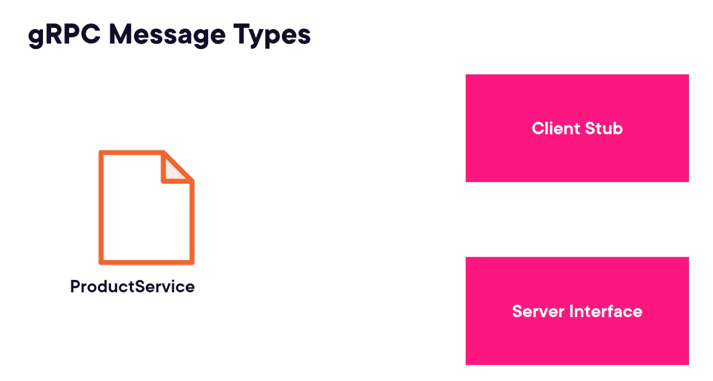

# Building Microservices in Go

## Chapter 4 Serving Static Content From Our Web Service

- fmt.Fprint
- http.ServeFile
- http.ServeContent
- http.FileServer

## Chapter 5 JSON Protocal

## Chapter 6 Routing Request In Go Microservices

The third type is parametric route: 

/customers/{id}

// Request a single resource 
http.Handle("/customers", handler) // request the customers resource

// Request a resource collection
http.Handle("/customers/", handler) // request the customers collection

## Common Uses for Middleware

- Caching, Authentication, Session management, Logging and telemetry and Response compression.

- Middleware is just a handler. 

- Global and Route-specific

## gRPC Structure

The primary transport protocol used in gRPC is Protocol Buffer. 

Protocol Buffers 101

        syntax = "proto3";
        package product; 
        option go_package = "demo/productpb";
        message Product {
            int32 id = 1; 
            string name = 2;
            double usdPerUnit = 3; 
            string unit = 4;
        }

https://protobuf.dev/downloads // obtain protoc compiler

The proto c compiler is designed to take Protocol Buffer messages and generate source code in a variety of different language. 

Also need to add a specific tool: go install google.golang.org/protobuf/cmd/protoc-gen-go@latest  // install go package for code generation

// Invoke protoc compiler
protoc -I= . -go_out=. /product.proto // generate source code. 

## How to set up gRPC client and server 

        go install google.golang.org/grpc/cmd/protoc-gen-go-grpc@latest // install go package for code generation

        protoc -I=. -go_out=. -go-grpc_out=. /product.proto // generate source code

What does the service code look like: 

        // Client 
        type ProductClient interface {
            GetProduct(ctx context.Context, in *GetProductRequest, opts ...grpc.CallOption) (*GetProductReply, error)
        }

        // Don't need to define the client, it has been taken care of by the code generation. But we do need to retrieve that client.

        client := NewProductClient({connection})

        // Server - with less help, we will just get an interface which we need to implement
        type ProductServer interface {
            GetProduct(context.Context, in *GetProductRequest) (*GetProductReply, err)
        }