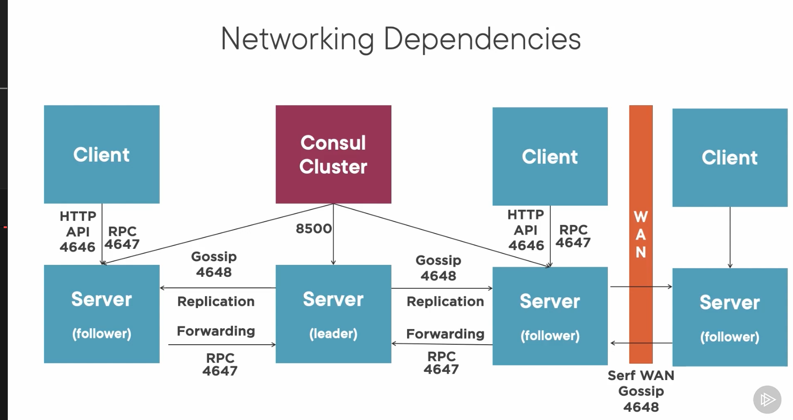
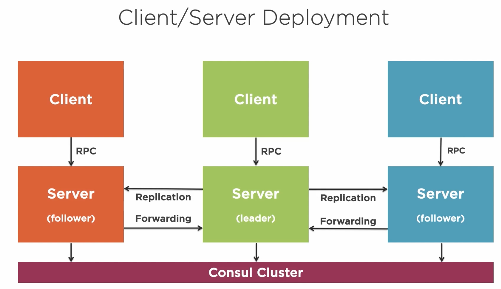
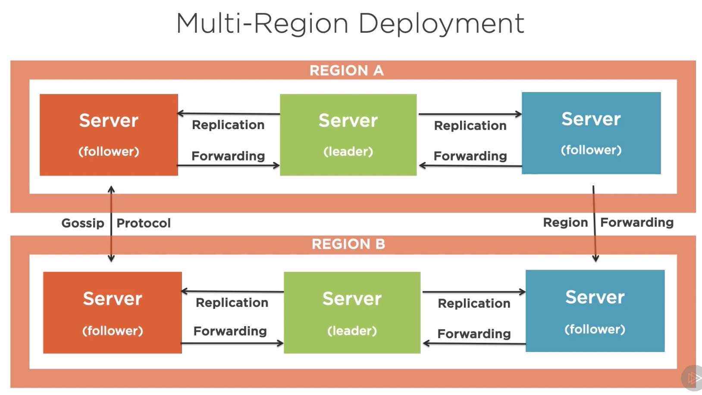
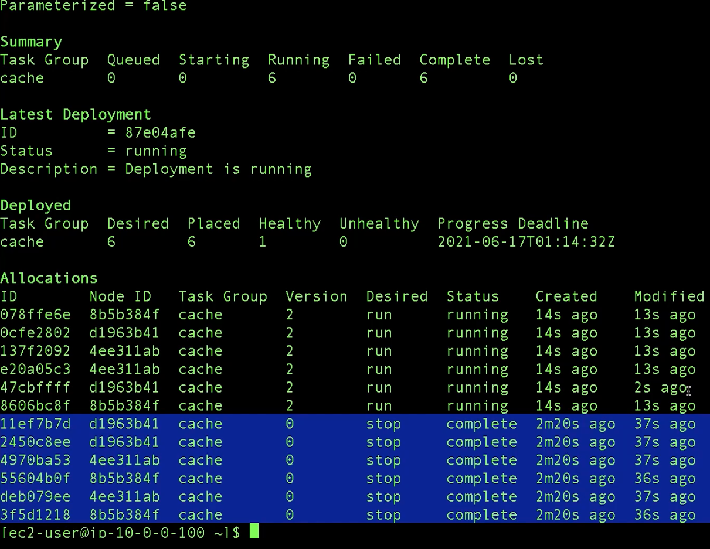

# Nomad Tutorial

Nomad is just a single binary.

## Nomad Dependencies

Ideal to have Consul as an auto-discovery + service mesh

Task drivers to support various jobs/workloads

Persistent storage plugins needed for stateful workloads

Secret management (e.g. Vault)

### Persistent Storage for Nomad Workloads

- Nomad host volumes locally presented persistent storage. This host the volumes locally and just presented persistent storage.

- CSI plugins. Use CSI-certified backend storage.



## Nomad Deployment Patterns

## Single Region Deployment



## Multi-Region Deployment



## Understanding Nomad Namespaces

## Multi-Environment Support

Nomad can run Docker jobs alongside other types of workloads (such as VMs, Java processes, or binary executables), making it a versatile tool for managing heterogeneous environments.

## Nomad Deployment Using Infrastructure-as-Code

[Github Link](https://www.github.com/discoposse/nomad-aws-minilab)

In Nomad or Consul, when ACLs are enabled, you typically need to bootstrap the system, which involves generating a root token that grants administrative access and setting up initial policies and roles. If ACLs were enabled right from the start, you'd need to immediately go through this bootstrapping process to define access controls.

Monitoring process: telemetry

telemetry {
collection_interval = "1s"
disable_hostname = true
prometheus_metrics = true
publish_allocation_metrics = true
publish_node_metrics = true
}

For a sample configuration code, you would have 3 nodes run locally for the server side and however many clients you choose to run to actually execute and run the tasks and jobs themselves.

## What Makes a Hybrid Nomad Deployment

## Handle Configuration, Secrets and TLS in Nomad

- Use Nomad templates for configuration and integrate with Vault for secrets management.
- Handle TLS certificates manually or through Vault, as Nomad does not manage them automatically like Kubernetes.

- Yes, HashiCorp Nomad provides a command-line interface (CLI) that you can use to deploy jobs and manage configurations, similar to how you use kubectl with Kubernetes.

        // Create a Job specification first
        // Deploy your Nomad job using CLI

        nomad job run my-go-app.nomad

## Notes regarding tls_key

During the TLS handshake, the server presents its certificate, which contains the public key. The corresponding private key (tls_key) is kept secure on the server and is used to establish a secure connection.

The private key associated with the tls_key is used to decrypt data that has been encrypted with the corresponding public key.

## uDeploy vs. Nomad

uDeploy specializes in managing and automating deployments across various environments (development, stating, production). It handles tasks like versioning, environment configurations, rollback procedures, and approvals, making it suitable for complex deployment processes.

Nomad is designed for job scheduling and orchestration. Designed for running and scheduling jobs, whether they are long-running services, batch jobs, or single tasks. It excels at managing containerized applications and can handle service discovery, load balancing, and scaling.

Nomad allows for scaling applications and managing their lifecycle (starting, stopping, and restarting jobs) efficiently, while uDeploy handles the intricacies of getting those applications into the desired environments.

While Nomad can certainly manage deployments to some extent, especially for containerized applications, it is typically used in conjunction with tools like uDeploy for several reasons:

- Deployment strategies: uDeploy supports blue-green, canary, rolling updates.
- Integrations: uDeploy often integrates with other tools and processes in the DevOps pipeline, providing a more holistic view of the deployment process.
- Approval processes: uDeploy can manage manual approval steps in the deployment process, which might be necessary in regulated environments.

## Managing and Monitor Nomad Jobs

Review a sample job specification to understand common parameters: create a simple job, configure health checks, customize restart behavior, configure affinity, configure priority.

        // create an example .nomad file
        nomad init // -> Example job file written to example.nomad

        // open it up in your editor // -> code example.nomad


Create and manage a simple job using the Nomad CLI

- dry run
- run a new job
- scale a running job
- stream logs from the task
- restart a running job
- stop a running job

        nomad job status [redis]
        nomad job plan redis.nomad // Doing the initial evaluation
        nomad job run -check-index 0 redis.nomad
        nomad inspect redis

        nomad job scale redis 6 // scale the job to 6
        nomad alloc logs jobID // streaming the logs
        nomad alloc exec jobID cat /etc/resolv.conf
        nomad stop redis

        nomad job eval redis


Continue to maintain the state and the history of the information.


## Using Deployments

Beyond the simple job allocation, we can go into better lifecycle management by using what we called deployments. Enable controlled updates for Nomad jobs.

Deployment configuration is part of the template stanza

        // redis.nomad

        # Configure the job to do rolling updates
        update {
            stagger = "10s"
            max_parallel = 2
            min_healthy_time = "30s"
            healthy_deadline = "10m"
            canary = 1
        }

Create a deployment and manage job lifecycle during an application update.

Distribute the jobs and tasks using multiple datacenters as well as other capabilities like deployments, rolling updates, and health checks.

        nomad operator snapshot save disco.snap
        nomad operator snapshot inspect disco.snap
        nomad operator snapshot restore disco.snap
        cd /var/log

# For Comparison: What's the difference between context and namespace in Kubectl

In the context of `kubectl` configuration for Kubernetes, **contexts** and **namespaces** serve different purposes, but both help in managing how you interact with your Kubernetes clusters.

### 1. **Namespace:**

- A **namespace** in Kubernetes is a way to logically partition the resources within a **single Kubernetes cluster**.
- Namespaces help isolate resources (like pods, services, deployments, etc.) into different groups so that they can be managed separately, providing a level of organizational or security separation between teams, environments (e.g., dev, staging, prod), or applications within the same cluster.
- **By default**, Kubernetes has a `default` namespace, but you can create additional namespaces for different purposes.

**Key Points:**

- It is a **cluster-level resource**.
- It allows you to organize resources (like pods and services) into isolated groups within the same cluster.
- When running `kubectl` commands, if no namespace is specified, the `default` namespace is used.
- You can specify a namespace when working with resources using the `-n` or `--namespace` flag:
  ```bash
  kubectl get pods -n mynamespace
  ```

**Example of a namespace:**

```yaml
apiVersion: v1
kind: Namespace
metadata:
  name: dev-environment
```

### 2. **Context:**

- A **context** in Kubernetes is a configuration that ties together a **cluster**, a **user** (credentials), and an optional **namespace**. It allows you to switch between multiple Kubernetes clusters or environments easily.
- **Contexts** are defined in the `kubectl` configuration file (usually `~/.kube/config`), and each context specifies:
  - Which **cluster** you are interacting with.
  - Which **user** (or credentials) to use.
  - Optionally, which **namespace** to use as the default for commands when that context is active.
- Contexts make it easy to switch between multiple clusters or environments (e.g., development, production) without manually providing cluster and user information in each command.

**Key Points:**

- A **context** defines the combination of a **cluster**, **user**, and optionally a **namespace**.
- You can switch between different contexts using the `kubectl config use-context` command:
  ```bash
  kubectl config use-context dev-context
  ```
- Each context can be associated with different clusters, users, and default namespaces.

**Example of a context:**

```yaml
contexts:
  - name: dev-context
    context:
      cluster: dev-cluster
      user: dev-user
      namespace: dev-namespace
```

### Key Differences:

| **Aspect**          | **Namespace**                                                | **Context**                                                      |
| ------------------- | ------------------------------------------------------------ | ---------------------------------------------------------------- |
| **Purpose**         | Organizes resources within a single cluster                  | Combines cluster, user, and namespace for easy cluster switching |
| **Scope**           | Limited to a single cluster                                  | Can span multiple clusters, each with its own configuration      |
| **Usage**           | Used to isolate resources within a cluster (e.g., dev, prod) | Used to switch between different clusters, users, and namespaces |
| **kubectl Command** | `kubectl get pods -n <namespace>`                            | `kubectl config use-context <context-name>`                      |
| **Configuration**   | Does not include cluster or user configuration               | Combines cluster, user, and namespace in one configuration       |

### Practical Example:

If you are working with two clusters (development and production), you could define separate contexts for each:

1. **Context for Development Cluster:**

   - Cluster: `dev-cluster`
   - User: `dev-user`
   - Namespace: `dev-namespace`

   ```yaml
   contexts:
     - name: dev-context
       context:
         cluster: dev-cluster
         user: dev-user
         namespace: dev-namespace
   ```

2. **Context for Production Cluster:**

   - Cluster: `prod-cluster`
   - User: `prod-user`
   - Namespace: `prod-namespace`

   ```yaml
   contexts:
     - name: prod-context
       context:
         cluster: prod-cluster
         user: prod-user
         namespace: prod-namespace
   ```

You can then switch between contexts:

```bash
# Switch to the development context
kubectl config use-context dev-context

# Switch to the production context
kubectl config use-context prod-context
```

### Summary:

- **Namespace**: A way to partition resources within a **single cluster**.
- **Context**: A configuration that defines which **cluster, user, and namespace** you are working with, and it helps switch between multiple clusters or environments.
