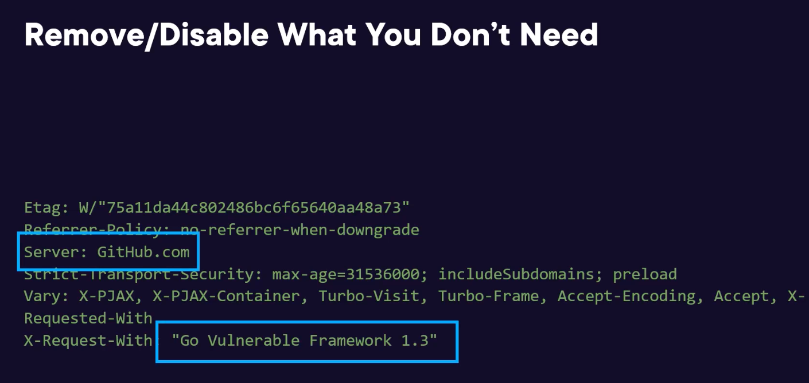

# Securing Coding in Go

Built-in Security Control Libraries:

- Input Validation
- Access Control
- Cryptography
- Secure logging
- Auditing
- TLS

Risks:

- Injection attacks
- Broken authentication
- Broken session management
- Broken access control
- Security misconfigurations
- Impact and ways to mitigate

ASVS (Application Security Verification Standard) three main categories

- Verification requirements.
- Functional requirements.
- Technical requirements.

## Concept of input validation techniques

- Whitelisting, boundary-checking and character escaping.

- In Go, a null byte is represented using \x00 value. Cause the string to terminate prematurely.

## 04 Output Encoding

Modify the Content-Type header to trick the server to serve the malicious content. (e.g. image/png and serve their content in the image)

## Session Management

Manage session in a secure manner.

JWT: Header, Payload, Signature. (Stateless session)

- Header: Includes the cryptographic algorithm.
- Payload: Includes claims (attributes).
- Signature: Used to verify the integrity of the session.

Secure Session Identifiers. Cookie Attribute Configuration (Domain, Path, Expires, HttpOnly, Secure)

Session integrity.

Session identifier should never be sent in the url, instead they should be embedded in the HTTP cookie header.

Token and Logout

## Access Control

Should be a singular component utilized for entire web application.

Enforce authorization controls on every request.

## Cryptographic Practices

## NaCl

## Error and Logging Handling

## Logging

Logging should be managed by the application itself, and should not solely rely on server configuration.

Use a master routine for logging. Responsible for handling all logging operations. Avoid logging debugging info and stack traces.

## Advanced Logging

Logrus hooks:

        type MyHook struct{}

        func (h *MyHook) Levels() []logrus.Level {
            return logrus.AllLevels
        }

        func (h *MyHook) Fire(entry *logrus.Entry) error {
            // Send logs to external service
            return nil
        }

        logrus.AddHook(&MyHook{})

Fields Logging:

        logrus.WithFields(logrus.Fields{
            "filename": "main.go",
            "func": "main",
        }).Error("File processing failed")

Entry-Level Logging:

        entry := logrus.WithFields(logrus.Fields{
            "component": "database",
        })

        entry.Info("Connected to DB")
        entry.Error("Failed to query DB")

Custom Formatters:

        type MyFormatter struct{}

        func (f *MyFormatter) Format(entry *logrus.Entry) ([]byte, error) {
            return []byte(fmt.Sprintf("%s: %s\n", entry.Level, entry.Message)), nil
        }
        logrus.SetFormatter(&MyFormatter{})

For high performance, might opt for libraries like Zap or ZeroLog.

To ensure log validity and integrity, use cryptographic hash functions for logs.

## Data Protection

Search engine has the capability to store URLs as they come across them while indexing web pages.

HTTP server, like apache nginx typically record access log files, which include the requested URL along with the query string.

        const api_key = "YOUR_API_KEY";
        const response = http.get("https://api.example.com/data?api_key=" + api_key)

For URL through HTTPs, even though encrypted, it's not recommended, because URLs, including query parameters, are often logged by web servers, proxies, and browser history. This means that if you include an API key in the URL, it may be logged in places where encryption is no longer in effect (e.g, server logs, browser history, shared links).

        GET /data/resource HTTP/1.1
        Host: api.example.com
        Authorization: Bearer <API_KEY>

The Authorization headers is commonly used for sending API keys or tokens securely.

HTTP headers are encrypted when using HTTPS, just like query parameters, but they are not exposed in logs or browser history.

Using POST requests (if appropriate) and placing sensitive data in the request body (which is also encrypted with HTTPS) can be a safer option. This approach avoids the risks associated with URL exposure, such as logging and caching.

## Cache Protection

- Disable cache control for sensitive info
- Use header flag

        // no-cache primarily focuses on revalidation;
        // no-store primarily focuses on preventing storage;
        w.Header().Set("Cache-Control", "no-cache, no-store")

        // dealing with legacy system, http1.0
        w.Header().Set("Pragma", "no-cache")

## Communication Security

HTTP/TLS

        import "log"
        import "net/http"
        func main() {
            http.HandleFunc("/", func(w http.ResponseWriter, req *http.Request) {
                w.Write([]byte("This is an example server.\n"))
            })
            // yourCert.pem - path to your server certification in PEM format
            // yourKey.pem - path to your server private key in PEM format

            log.Fatal(http.ListenAndServeTLS(":443", "yourCert.pem", "yourKey.pem", nil))
        }

Before SNI (Server Name Indication), a server could only present a single TLS certificate per IP address or port. Hosting different websites on the same IP address is challenging.

SNI enables hosting multiple websites with different certificates. Server selects certificate based on requested hostname from tls.Config. A server can host multiple websites on the same IP address and port combination, each with its own certificate.

Setting example in production:

        config := &tls.Config{InsecureSkipVerify: false}
        config := &tls.Config{ServerName: "yourHostName"}

Character consistent encoding:

        w.Header().Set("Content-Type", "Desired Content Type; charset=utf-8)

Sensitive information like authentication token, PII, should not be included in the HTTP header when sending to the external sites.

## WebSockets

Real-time and bidirectional communication

Eliminate the need for repeated HTTP request and responses by upgrading the original HTTP request to a fully-fledged TCP socket after a successful handshake.

For HTTP, once a response has been sent to the client for the request, you cannot send another response for the same request. This will cause an error. Because, http is based on request-response model.

SSE Server-Sent Event (SSE) allows the server to push updates to the client over a single HTTP connection.

        w.Header().Set("Content-Type", "text/event-stream")
        w.Header().Set("Cache-Control", "no-cache")
        w.Header().Set("Connection", "keep-alive")

Origin Header Validation

        // Compare our origin with Host and act accordingly
        if r.Header.Get("Origin") != "http://" + r.Host {
            http.Error(w, "Origin not allowed", 403)
            return
        } else {
            websocket.Handler(EchoHandler).ServeHTTP(w, r)
        }

Using an unencrypted websocket, the uri scheme is ws://...:80 (over the regular http traffic without encryption)

wss://...443 is encrypted socket.

Input Sanitization:

Properly sanitize and validate input data from untrusted sources to remove potentially harmful elements.

Apply output encoding technique to neutralize special characters or entities in the output and prevent attacks like cross-site-scripting (XSS).

## System Configuration

Mitigate directory listing vulnerability.

Restricting Directory Listing

- Disable directory listings in web app
- Implement access restrictions, prevent unauthorized access
- Create index files, hide directory listings

After Deployed in Prod: Remove/Disable What you don't need

- Eliminate unnecessary functionalities and files.
- Remove test code and unused functions.
- Limit developer-layer access to these elements.
- Pay attention to HTTP response headers.
- Remove headers that disclose sensitive information.
- Avoid headers that reveal OS, web server, and programming language details.

        // Search and identify this type of http header
        w.Header().Set("X-Request-With", "Go Vulnerable Framework 1.3")

Implementing Cross-Origin Resource Sharing (CORS) can help increase security.

Note CORS is working with browser:

- CORS provides a way for servers to relax the same-origin policy by sending specific HTTP headers that define which origins are allowed to access the resources, what methods are allowed (GET, POST, etc.) and whether credentials (like cookies) can be sent along with the request.

        // CORS Middleware
        // The browser might block the access to the response based on the CORS headers.
        // The CORS headers from the server control whether the JavaScript in the client's browser can access the response after the request is made.

        func corsMiddleware(next http.Handler) http.Handler {
            return http.HandlerFunc(func(wr) {
                // Set CORS headers to allow requests from any origin (for example)
                w.Header().Set("Access-Control-Allow-Origin", "*")
                w.Header().Set("Access-Control-Allow-Methods", "GET, POST, OPTIONS")
                w.Header.Set("Access-Control-Allow-Headers", "Content-Type")

                // If it's a preflight request (OPTIONS method), end the request here
                if r.Method == http.MethodOptions {
                    w.WriteHeader(http.StatusOK)
                    return
                }

                // Call the next handler in the chain
                next.ServeHTTP(w, r)
            })
        }

Configuring robots.txt file

        User-agent: *
        Allow: /sitemap.xml
        Allow: /index
        Allow: /contact
        Allow: /aboutus
        Disallow: /

## Asset Management System

# Database Security

- Secure database configuration
- Unnecessary accounts, databases
- Input validation, output encoding
- Database authentication
- Secure code sharing on repositories
- Connection pool, lazy creation
- Access credentials, separate file
- Parameterized queries, prepared statements: SQL injection defense
- Stored procedures: security, access management, optimization

                  // Read the configuration file
                  configFile, _ := os.Open("../private/configDB.xml")
                  db, _ := sql.Open(severDB, userDB, passDB)

  Prepared Statement with Parameterized Query Example

                  patientName := r.URL.Query().Get("name")
                  db.Exec("UPDATE patients SET name=? WHERE patientId=?", patientName, 233, 90)

Stored Procedure
- Customized views control data access 
- Prevent exposure of sensitive information 
- Encapsulate complex logic within procedures 
- Interface for specific procedure usage 
- Differentiate information access
- Control access to tables and columns 

                // Stored procedure example 
                CREATE PROCEDURE db.getName @userId int = NULL
                AS 
                        SELECT name, lastname FROM tblUsers WHERE userId = @userId 
                GO
                EXEC db.getName @userId = 14

User only interacts with stored procedure. This limits direct access to the underlying tables and sensitive data. 

                // Prepare the query to call the stored procedure 
                query := `SELECT employee_id, employee_name, salary FROM get_employee_salary($1, $2)`

                row := db.QueryRow(query, employeeID, userRole)

                // Scan the result into the Employee struct 
                err := row.Scan(&employee.ID, &employee.Name, &employee.Salary)

                // Main function 
                connStr := "user=username dbname=mydb sslmode=disable password=mypassword"
                db, err := sql.Open("postgres", connStr)

## File Management 

## General Coding Practice
Buffer boundary checking necessity

Cross-Site Request Forgery

Implement "nonce-based token validation" to address CSRF effectively. When user request a form, server generates a unique nonce for each form page, which is essentially a unique and arbitrary number designed to be used once. 

This nonce is hidden in the form and when the user submits the form the hidden field containing the nonce is sent to the server. 

Assign a unique nonce/token to each user session. 

Pay attention to the regex DeDos. Go's regex engine RE2 consciously avoids backtracking. Back-references and Look-around features are not supported in RE2, which is the regex engine in Go. This departs Go from other regular expression engine in other languages. 

The standard Go regex doesn't support /1 group syntax. Instead considering using dlclark/regexp2 for more fully featured alternative. However, this doesn't guarantee the safety vulnerability like linear time performance. 

